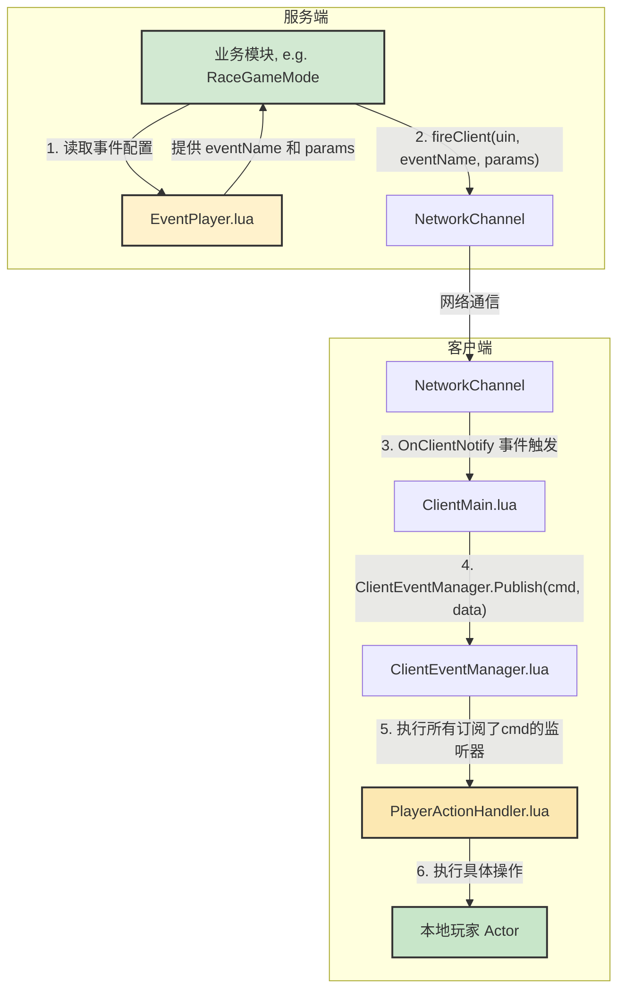

# 客户端与服务端交互规范

## 前言

本文档旨在统一项目客户端与服务端的通信模式、代码组织方式和配置管理，为后续开发提供清晰、可遵循的指导。遵循本规范可以极大提高开发效率，降低模块间的耦合度，增强代码的可维护性。

---

## 一、 通信流程

客户端与服务端的核心通信基于一个事件驱动模型。所有由服务端发起、需要客户端响应的指令，都遵循以下标准流程：



**流程详解:**

1.  **服务端发起**：服务端的业务模块（如 `RaceGameMode`）从相应的事件配置文件（如 `EventPlayer.lua`）中获取事件名和参数。
2.  **发送事件**：服务端调用 `gg.network_channel:fireClient(uin, eventName, params)`，将指令和数据通过网络通道发送给指定的客户端。
3.  **客户端接收**：客户端的 `ClientMain.lua` 监听 `OnClientNotify` 事件，接收来自服务端的所有消息。
4.  **事件发布**：`ClientMain.lua` 将收到的原始消息通过 `ClientEventManager.Publish` 进行发布，交由事件中心处理。
5.  **事件订阅与处理**：专门的处理器模块（如 `PlayerActionHandler.lua`）因预先订阅了该事件名，其对应的回调函数被触发。
6.  **执行操作**：处理器模块执行最终的客户端逻辑，例如操作本地玩家的Actor、更新UI等。

---

## 二、 代码创建规则

为了保持代码的整洁和高内聚，所有用于处理服务端指令的客户端逻辑，都应遵循以下规则创建新模块：

1.  **创建专用目录**：在 `scriptFiles/game/MainStorage/Code/Client/` 下，根据功能创建一个高内聚的目录，例如 `PlayerAction/`、`GameUI/` 等。

2.  **创建处理器模块**：在新建的目录中，创建处理器文件，如 `PlayerActionHandler.lua`。

3.  **模块基本结构**：
    *   处理器应实现为一个**类**。
    *   必须包含一个 `OnInit()` 方法，作为模块的初始化入口。
    *   在 `OnInit()` 方法内部，调用一个私有的 `SubscribeServerEvents()` 方法。
    *   `SubscribeServerEvents()` 方法负责使用 `ClientEventManager.Subscribe()` 来订阅所有该模块关心的服务端事件。每个订阅都应对应一个具体的处理函数。

    ```lua
    -- PlayerActionHandler.lua 示例
    local PlayerActionHandler = ClassMgr.Class("PlayerActionHandler")
    
    function PlayerActionHandler:OnInit()
        self:SubscribeServerEvents()
    end
    
    function PlayerActionHandler:SubscribeServerEvents()
        ClientEventManager.Subscribe(EventPlayerConfig.NOTIFY.LAUNCH_PLAYER, function(data)
            self:OnLaunchPlayer(data)
        end)
    end
    
    function PlayerActionHandler:OnLaunchPlayer(data)
        -- 具体逻辑...
    end
    
    return PlayerActionHandler
    ```

4.  **模块注册**：在客户端主入口 `ClientMain.lua` 的 `start_client()` 函数中，`require` 新创建的处理器模块，并调用其 `OnInit()` 方法完成注册。**严禁在 `ClientMain.lua` 中直接编写业务逻辑。**

    ```lua
    -- ClientMain.lua 示例
    function ClientMain.start_client()
        -- ... 其他初始化
        
        -- 初始化玩家操作处理器
        local PlayerActionHandler = require(MainStorage.Code.Client.PlayerAction.PlayerActionHandler)
        PlayerActionHandler:OnInit()
    
        -- ...
    end
    ```

---

## 三、 配置规则

为了实现代码与配置的分离，所有跨客户端/服务端的事件都必须在配置中统一定义。

1.  **配置文件位置**：所有事件配置文件都必须存放在项目的中央配置目录中：`scriptFiles/game/MainStorage/Code/Event/`。

2.  **配置文件结构**：配置文件必须遵循标准结构，参考 `EventMail.lua` 和 `EventPlayer.lua`。
    *   **事件定义 (`REQUEST`, `RESPONSE`, `NOTIFY`)**: 对不同来源和用途的事件进行分类。
    *   **参数定义 (`ACTION_PARAMS`)**: 独立存放与事件关联的默认参数，以事件名为键。
    *   **错误码 (`ERROR_CODES`, `ERROR_MESSAGES`)**: 统一定义业务逻辑相关的错误信息。
    *   **辅助函数 (`GetActionParams`, `GetErrorMessage`)**: 提供便捷的函数来访问配置数据。

3.  **配置使用原则**：
    *   任何需要发送或接收跨端事件的代码，都**必须** `require` 相应的配置文件。
    *   代码中**严禁**出现硬编码的事件名（“魔术字符串”）。
    *   所有事件名、参数、错误码等，都应从配置文件中读取。

    ```lua
    -- RaceGameMode.lua 使用示例
    local eventName = EventPlayerConfig.NOTIFY.LAUNCH_PLAYER
    local launchParams = EventPlayerConfig.GetActionParams(eventName)
    gg.network_channel:fireClient(player.uin, eventName, launchParams)
    ```

在修改我的HandleUpgradeStarSkill设个升星的函数流程现在的流程需要记录为升星的时候要进行如判断升级对应技能需要到达 1星对应10，2星15级，3星25级，4星35级，5星50级，6星70级，7星100级，然后每一次升星都会重置当技能的等级和成长进度为0，如果没有到达字段需求等级就返回客户端提示


大佬有个问题请教下:游戏是每个房间独立开辟的新服务进程，我在A房间通过管理员账户发送了一条全服邮件，但是我想要广播到游戏所有房间。相关功能的公共服务接口有吗？我检索了api，没有发现向其它房间广播消息的接口