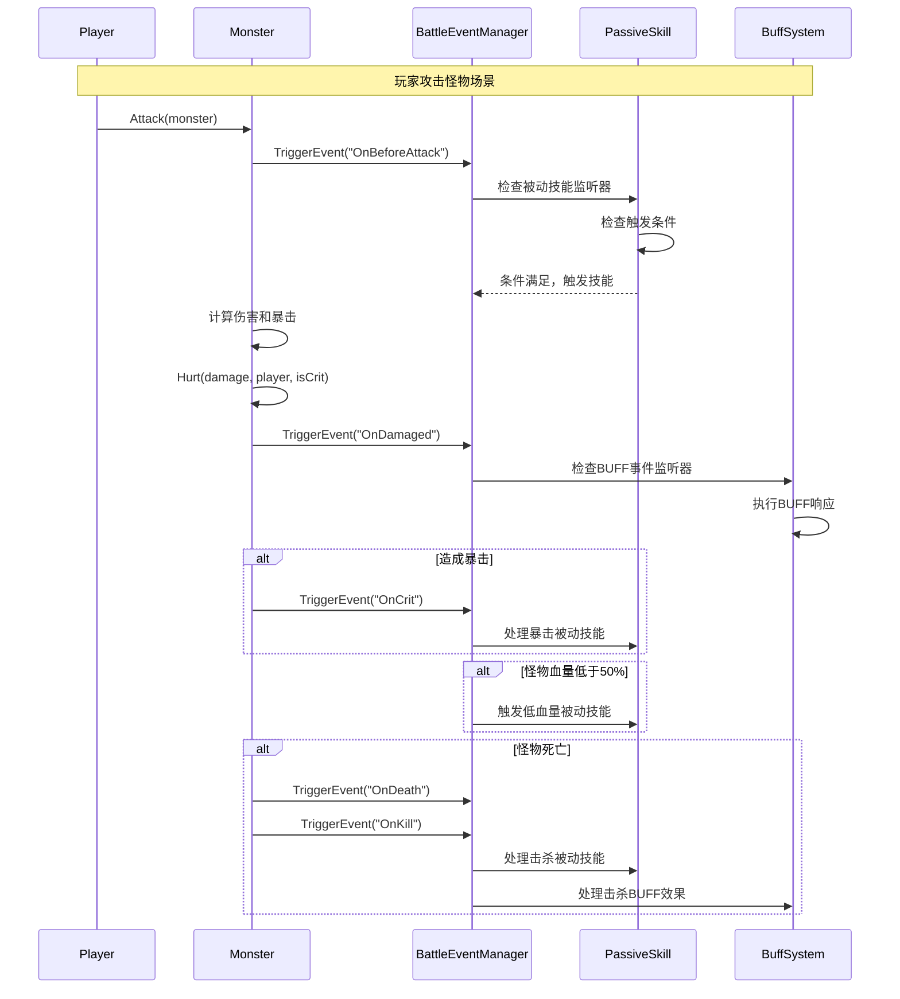

# 战斗事件自动检测和触发系统

## 1. 在现有代码中插入事件触发点

### 1.1 修改Entity基类 - 添加事件触发机制

```lua
-- 在 Entity.lua 中添加事件系统
---@class Entity
local Entity = require(MainStorage.code.server.entity_types.Entity)

-- 添加战斗事件管理器引用
local BattleEventManager = require(MainStorage.code.server.BattleEventManager)

-- 重写攻击方法，添加攻击事件触发
function Entity:Attack(target)
    -- 触发攻击前事件
    BattleEventManager:TriggerEvent("OnBeforeAttack", {
        attacker = self,
        target = target,
        timestamp = gg.GetTimeStamp()
    })
    
    -- 执行原有攻击逻辑
    local damage = self:CalculateDamage(target)
    local isCrit = self:CheckCritical()
    
    -- 实际造成伤害
    target:Hurt(damage, self, isCrit)
    
    -- 触发攻击后事件
    BattleEventManager:TriggerEvent("OnAttack", {
        attacker = self,
        target = target,
        damage = damage,
        isCrit = isCrit,
        timestamp = gg.GetTimeStamp()
    })
    
    -- 如果是暴击，触发暴击事件
    if isCrit then
        BattleEventManager:TriggerEvent("OnCrit", {
            attacker = self,
            target = target,
            damage = damage,
            timestamp = gg.GetTimeStamp()
        })
    end
end

-- 重写受伤方法，添加受伤事件触发
function Entity:Hurt(amount, damager, isCrit)
    local originalHealth = self.health
    
    -- 触发受伤前事件
    BattleEventManager:TriggerEvent("OnBeforeDamaged", {
        victim = self,
        attacker = damager,
        damage = amount,
        isCrit = isCrit,
        originalHealth = originalHealth,
        timestamp = gg.GetTimeStamp()
    })
    
    -- 执行原有受伤逻辑
    local actualDamage = math.min(amount, self.health)
    self.health = self.health - actualDamage
    
    -- 触发受伤后事件
    BattleEventManager:TriggerEvent("OnDamaged", {
        victim = self,
        attacker = damager,
        damage = actualDamage,
        remainingHealth = self.health,
        isCrit = isCrit,
        timestamp = gg.GetTimeStamp()
    })
    
    -- 如果攻击者存在，触发造成伤害事件
    if damager then
        BattleEventManager:TriggerEvent("OnDealDamage", {
            attacker = damager,
            victim = self,
            damage = actualDamage,
            isCrit = isCrit,
            timestamp = gg.GetTimeStamp()
        })
    end
    
    -- 检查是否死亡
    if self.health <= 0 then
        self:Die()
    end
end

-- 重写死亡方法，添加死亡和击杀事件
function Entity:Die()
    -- 触发死亡事件
    BattleEventManager:TriggerEvent("OnDeath", {
        victim = self,
        killer = self.lastDamager, -- 需要在Hurt中记录lastDamager
        timestamp = gg.GetTimeStamp()
    })
    
    -- 如果有击杀者，触发击杀事件
    if self.lastDamager then
        BattleEventManager:TriggerEvent("OnKill", {
            killer = self.lastDamager,
            victim = self,
            timestamp = gg.GetTimeStamp()
        })
    end
    
    -- 执行原有死亡逻辑
    self.isDead = true
    -- ... 其他死亡处理
end

-- 添加技能释放事件触发
function Entity:CastSkill(skill, target)
    -- 触发技能释放前事件
    BattleEventManager:TriggerEvent("OnBeforeCastSkill", {
        caster = self,
        skill = skill,
        target = target,
        timestamp = gg.GetTimeStamp()
    })
    
    -- 执行技能
    local success = skill:Cast(self, target)
    
    if success then
        -- 触发技能释放后事件
        BattleEventManager:TriggerEvent("OnCastSkill", {
            caster = self,
            skill = skill,
            target = target,
            timestamp = gg.GetTimeStamp()
        })
    end
    
    return success
end
```

### 1.2 修改Monster类 - 添加怪物特定事件

```lua
-- 在 Monster.lua 的 Hurt 方法中添加事件触发
function Monster:Hurt(amount, damager, isCrit)
    -- 记录最后攻击者（用于击杀事件）
    if damager then
        self.lastDamager = damager
        
        -- 记录伤害统计
        local uin = damager.uuid
        if damager.isPlayer then
            uin = damager.uin
        end
        local newHatred = (self.damageRecords[uin] or 0) + amount
        self.damageRecords[uin] = newHatred
        
        -- 更新仇恨目标
        if self.target and self.target ~= damager then
            local targetUin = self.target.uuid
            if self.target.isPlayer then
                targetUin = self.target.uin
            end
            local currentHatred = self.damageRecords[targetUin]
            if not currentHatred or currentHatred < newHatred then
                self:SetTarget(damager)
                
                -- 触发目标切换事件
                BattleEventManager:TriggerEvent("OnTargetChanged", {
                    monster = self,
                    oldTarget = self.target,
                    newTarget = damager,
                    reason = "hatred",
                    timestamp = gg.GetTimeStamp()
                })
            end
        end
    end
    
    -- 调用父类的Hurt方法（会触发通用的受伤事件）
    Entity.Hurt(self, amount, damager, isCrit)
    
    -- 怪物特定的受伤事件
    if amount > self.maxHealth * 0.1 then -- 伤害超过最大生命10%
        BattleEventManager:TriggerEvent("OnMonsterHeavyDamaged", {
            monster = self,
            attacker = damager,
            damage = amount,
            healthPercent = self.health / self.maxHealth,
            timestamp = gg.GetTimeStamp()
        })
    end
end

-- 重写Die方法，添加怪物死亡特定事件
function Monster:Die()
    -- 触发怪物死亡事件（包含掉落和经验）
    BattleEventManager:TriggerEvent("OnMonsterDeath", {
        monster = self,
        killer = self.lastDamager,
        damageRecords = self.damageRecords,
        level = self.level,
        timestamp = gg.GetTimeStamp()
    })
    
    -- 调用父类的Die方法
    Entity.Die(self)
    
    -- 发布原有的怪物死亡事件（保持兼容性）
    ServerEventManager.Publish("MobDeadEvent", {
        mob = self,
        damageRecords = self.damageRecords
    })
end

-- 添加怪物进入战斗事件
function Monster:SetTarget(target)
    local wasInCombat = self.target ~= nil
    local oldTarget = self.target
    
    -- 设置目标
    self.target = target
    
    if target and not wasInCombat then
        -- 进入战斗状态
        BattleEventManager:TriggerEvent("OnCombatStart", {
            monster = self,
            target = target,
            timestamp = gg.GetTimeStamp()
        })
    elseif not target and wasInCombat then
        -- 脱离战斗状态
        BattleEventManager:TriggerEvent("OnCombatEnd", {
            monster = self,
            lastTarget = oldTarget,
            timestamp = gg.GetTimeStamp()
        })
        
        -- 播放闲置音效
        if self.mobType.idleSound then
            self.scene:PlaySound(self.mobType.idleSound, self.actor, 0.8, 1.0)
        end
    end
end
```

### 1.3 修改Player类 - 添加玩家特定事件

```lua
-- 在 Player.lua 中添加玩家特定事件
function Player:LevelUp(newLevel)
    local oldLevel = self.level
    self.level = newLevel
    
    -- 触发升级事件
    BattleEventManager:TriggerEvent("OnLevelUp", {
        player = self,
        oldLevel = oldLevel,
        newLevel = newLevel,
        timestamp = gg.GetTimeStamp()
    })
    
    -- 其他升级逻辑...
end

-- 添加物品拾取事件
function Player:PickupItem(item, amount)
    -- 触发拾取前事件
    BattleEventManager:TriggerEvent("OnBeforePickupItem", {
        player = self,
        item = item,
        amount = amount,
        timestamp = gg.GetTimeStamp()
    })
    
    -- 执行拾取逻辑
    local success = self.bag:AddItem(item, amount)
    
    if success then
        -- 触发拾取后事件
        BattleEventManager:TriggerEvent("OnPickupItem", {
            player = self,
            item = item,
            amount = amount,
            timestamp = gg.GetTimeStamp()
        })
    end
    
    return success
end

-- 添加移动事件
function Player:Move(newPosition)
    local oldPosition = self:GetPosition()
    local distance = gg.vec.Distance3(oldPosition, newPosition)
    
    -- 只有移动距离超过阈值才触发事件
    if distance > 5 then
        BattleEventManager:TriggerEvent("OnMove", {
            player = self,
            oldPosition = oldPosition,
            newPosition = newPosition,
            distance = distance,
            timestamp = gg.GetTimeStamp()
        })
    end
    
    -- 执行移动逻辑
    self.actor.Position = newPosition
end
```

## 2. 战斗事件管理器实现

```lua
-- BattleEventManager.lua
local MainStorage = game:GetService('MainStorage')
local gg = require(MainStorage.code.common.MGlobal)

---@class BattleEventManager
local BattleEventManager = {}

-- 事件监听器存储
BattleEventManager.eventListeners = {}
BattleEventManager.passiveSkillListeners = {}
BattleEventManager.buffEventListeners = {}

-- 事件类型定义
BattleEventManager.EventTypes = {
    -- 攻击相关
    ON_BEFORE_ATTACK = "OnBeforeAttack",
    ON_ATTACK = "OnAttack",
    ON_CRIT = "OnCrit",
    
    -- 受伤相关
    ON_BEFORE_DAMAGED = "OnBeforeDamaged", 
    ON_DAMAGED = "OnDamaged",
    ON_DEAL_DAMAGE = "OnDealDamage",
    ON_HEAVY_DAMAGED = "OnHeavyDamaged",
    
    -- 死亡相关
    ON_DEATH = "OnDeath",
    ON_KILL = "OnKill",
    ON_MONSTER_DEATH = "OnMonsterDeath",
    
    -- 技能相关
    ON_BEFORE_CAST_SKILL = "OnBeforeCastSkill",
    ON_CAST_SKILL = "OnCastSkill",
    
    -- 战斗状态
    ON_COMBAT_START = "OnCombatStart",
    ON_COMBAT_END = "OnCombatEnd",
    ON_TARGET_CHANGED = "OnTargetChanged",
    
    -- 其他事件
    ON_LEVEL_UP = "OnLevelUp",
    ON_PICKUP_ITEM = "OnPickupItem",
    ON_MOVE = "OnMove",
    ON_HEAL = "OnHeal"
}

-- 注册被动技能监听器
function BattleEventManager:RegisterPassiveSkill(entity, skill, eventTypes)
    if not self.passiveSkillListeners[entity.uuid] then
        self.passiveSkillListeners[entity.uuid] = {}
    end
    
    for _, eventType in ipairs(eventTypes) do
        if not self.passiveSkillListeners[entity.uuid][eventType] then
            self.passiveSkillListeners[entity.uuid][eventType] = {}
        end
        
        table.insert(self.passiveSkillListeners[entity.uuid][eventType], {
            skill = skill,
            entity = entity,
            priority = skill.config.priority or 0
        })
        
        -- 按优先级排序
        table.sort(self.passiveSkillListeners[entity.uuid][eventType], function(a, b)
            return a.priority > b.priority
        end)
    end
end

-- 注册BUFF事件监听器
function BattleEventManager:RegisterBuffListener(entity, buff, eventTypes)
    if not self.buffEventListeners[entity.uuid] then
        self.buffEventListeners[entity.uuid] = {}
    end
    
    for _, eventType in ipairs(eventTypes) do
        if not self.buffEventListeners[entity.uuid][eventType] then
            self.buffEventListeners[entity.uuid][eventType] = {}
        end
        
        table.insert(self.buffEventListeners[entity.uuid][eventType], {
            buff = buff,
            entity = entity
        })
    end
end

-- 触发事件
function BattleEventManager:TriggerEvent(eventType, eventData)
    -- 记录事件日志（可选）
    if gg.debugMode then
        gg.log(string.format("战斗事件触发: %s, 参与者: %s", 
            eventType, 
            eventData.attacker and eventData.attacker.name or eventData.caster and eventData.caster.name or "未知"))
    end
    
    -- 处理被动技能监听
    self:ProcessPassiveSkillListeners(eventType, eventData)
    
    -- 处理BUFF事件监听
    self:ProcessBuffEventListeners(eventType, eventData)
    
    -- 处理通用事件监听器
    self:ProcessGeneralListeners(eventType, eventData)
end

-- 处理被动技能监听器
function BattleEventManager:ProcessPassiveSkillListeners(eventType, eventData)
    -- 获取所有相关实体
    local entities = {}
    if eventData.attacker then table.insert(entities, eventData.attacker) end
    if eventData.victim then table.insert(entities, eventData.victim) end
    if eventData.caster then table.insert(entities, eventData.caster) end
    if eventData.target then table.insert(entities, eventData.target) end
    
    for _, entity in ipairs(entities) do
        if entity and self.passiveSkillListeners[entity.uuid] then
            local listeners = self.passiveSkillListeners[entity.uuid][eventType]
            if listeners then
                for _, listener in ipairs(listeners) do
                    -- 检查实体状态
                    if not entity.isDead and listener.entity:HasSkill(listener.skill.skillId) then
                        -- 检查冷却
                        local cooldownKey = "passive_" .. listener.skill.skillId
                        if not entity:IsCoolingdown(cooldownKey) then
                            -- 检查触发条件
                            if self:CheckTriggerConditions(listener.skill, entity, eventData) then
                                -- 触发被动技能
                                self:ExecutePassiveSkill(listener.skill, entity, eventData)
                                
                                -- 设置冷却
                                if listener.skill.config.cooldown > 0 then
                                    entity:SetCooldown(cooldownKey, listener.skill.config.cooldown)
                                end
                            end
                        end
                    end
                end
            end
        end
    end
end

-- 处理BUFF事件监听器
function BattleEventManager:ProcessBuffEventListeners(eventType, eventData)
    -- 类似被动技能处理逻辑
    local entities = {}
    if eventData.attacker then table.insert(entities, eventData.attacker) end
    if eventData.victim then table.insert(entities, eventData.victim) end
    if eventData.caster then table.insert(entities, eventData.caster) end
    if eventData.target then table.insert(entities, eventData.target) end
    
    for _, entity in ipairs(entities) do
        if entity and self.buffEventListeners[entity.uuid] then
            local listeners = self.buffEventListeners[entity.uuid][eventType]
            if listeners then
                for _, listener in ipairs(listeners) do
                    if listener.buff.isActive then
                        listener.buff:OnEventTriggered(eventType, eventData)
                    end
                end
            end
        end
    end
end

-- 检查触发条件
function BattleEventManager:CheckTriggerConditions(skill, entity, eventData)
    if not skill.config.triggerConditions then
        return true
    end
    
    for _, condition in ipairs(skill.config.triggerConditions) do
        if not self:CheckSingleCondition(condition, entity, eventData) then
            return false
        end
    end
    
    return true
end

-- 检查单个条件
function BattleEventManager:CheckSingleCondition(condition, entity, eventData)
    local conditionType = condition.conditionType
    
    if conditionType == "ChanceCondition" then
        return math.random() * 100 <= condition.chance
    elseif conditionType == "HealthCondition" then
        local healthPercent = (entity.health / entity.maxHealth) * 100
        return healthPercent >= condition.minPercent and healthPercent <= condition.maxPercent
    elseif conditionType == "DamageTypeCondition" then
        return condition.damageTypes[eventData.damageType]
    elseif conditionType == "TargetTypeCondition" then
        return condition.targetTypes[eventData.target.entityType]
    end
    
    return true
end

-- 执行被动技能
function BattleEventManager:ExecutePassiveSkill(skill, entity, eventData)
    for _, effect in ipairs(skill.effects) do
        self:ExecuteSkillEffect(effect, entity, eventData)
    end
    
    if skill.config.enableLog then
        gg.log(string.format("被动技能触发: [%s] %s", entity.name, skill.skillName))
    end
end

-- 执行技能效果
function BattleEventManager:ExecuteSkillEffect(effect, caster, eventData)
    local target = self:DetermineEffectTarget(effect.target, caster, eventData)
    
    if effect.effectType == "DamageEffect" then
        local damage = effect.value
        if effect.isPercentage then
            damage = caster:GetStat("攻击") * (effect.value / 100)
        end
        target:Hurt(damage, caster, false)
        
    elseif effect.effectType == "HealEffect" then
        local healAmount = effect.value
        if effect.isPercentage and effect.baseValue == "DAMAGE_DEALT" then
            healAmount = eventData.damage * (effect.value / 100)
        end
        target:Heal(healAmount, caster)
        
    elseif effect.effectType == "AttributeBoostEffect" then
        for attrType, attrData in pairs(effect.attributes) do
            target:AddTemporaryAttribute(attrType, attrData.value, effect.duration)
        end
    end
end

-- 确定效果目标
function BattleEventManager:DetermineEffectTarget(targetType, caster, eventData)
    if targetType == "SELF" then
        return caster
    elseif targetType == "TRIGGER_SOURCE" then
        return eventData.attacker or eventData.caster
    elseif targetType == "EVENT_TARGET" then
        return eventData.target or eventData.victim
    else
        return caster
    end
end

return BattleEventManager
```

## 3. 实际使用流程图



## 4. 配置示例

```lua
-- 被动技能配置示例
PassiveSkillConfigs = {
    ["反击"] = {
        triggerEvents = {"OnDamaged"},
        triggerConditions = {
            {conditionType = "ChanceCondition", chance = 30},
            {conditionType = "HealthCondition", minPercent = 0, maxPercent = 50}
        },
        effects = {
            {
                effectType = "DamageEffect",
                target = "TRIGGER_SOURCE",
                value = 150,
                isPercentage = true
            }
        },
        cooldown = 2.0
    }
}
```

这套系统通过在现有的战斗逻辑关键点插入事件触发，实现了自动化的被动技能和BUFF触发机制，无需手动判断事件类型，系统会根据实际的战斗行为自动触发相应的事件。