# 技能系统完整组件分析

## 1. 技能完整组合模块总览

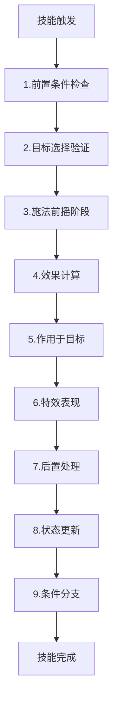

## 2. 技能执行主流程

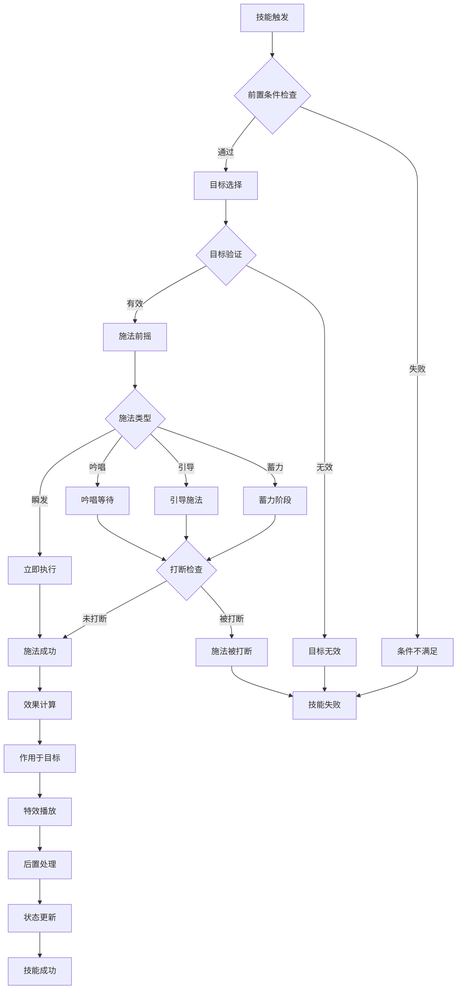

## 3. 核心模块详细分解

### 模块1：前置条件检查模块（整合验证）

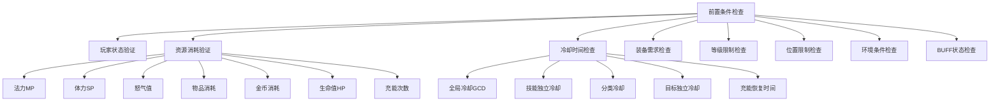

### 模块2：目标选择验证模块

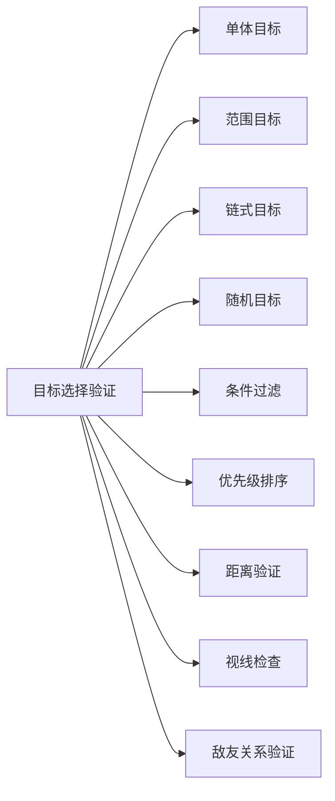

### 模块3：施法前摇阶段模块

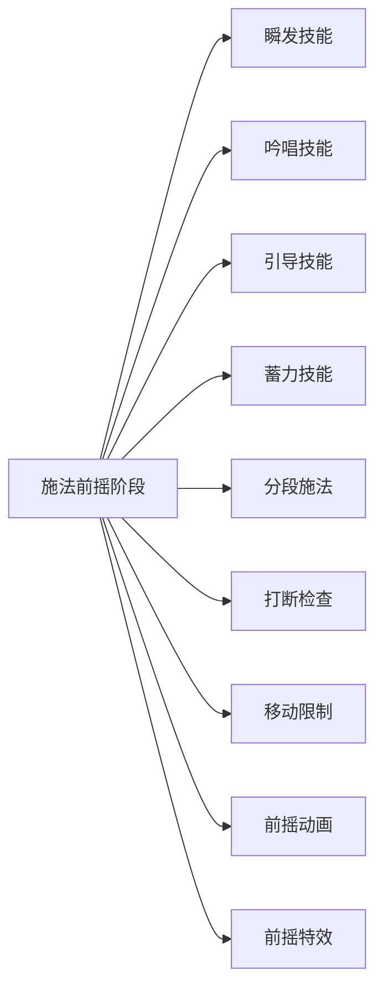

### 模块4：效果计算模块

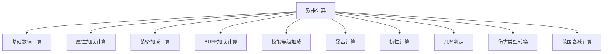

### 模块5：作用于目标模块

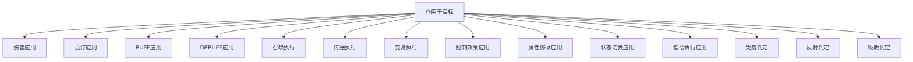

### 模块6：特效表现模块

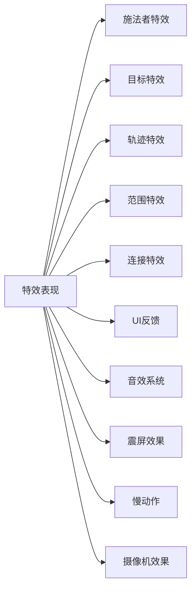

### 模块7：后置处理模块

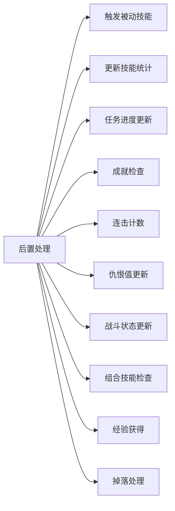

### 模块8：状态更新模块

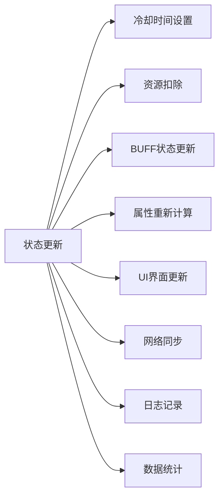

### 模块9：条件分支模块

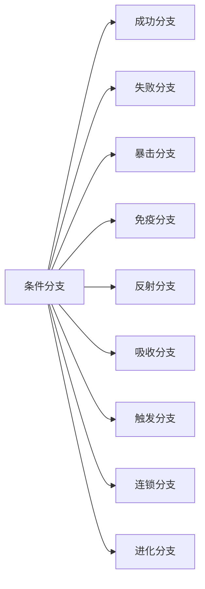

## 4. 技能组件交互层次结构

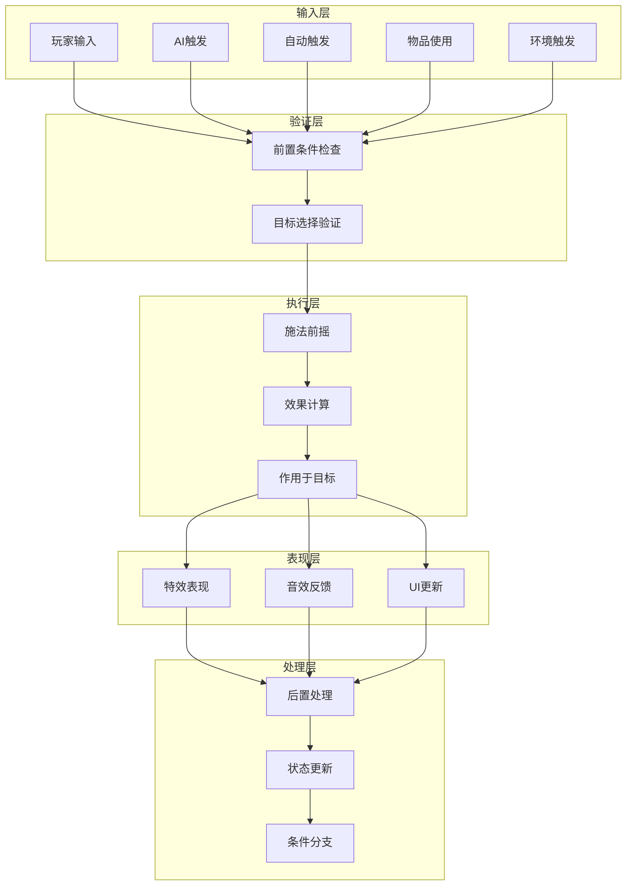

## 5. 详细执行时序图

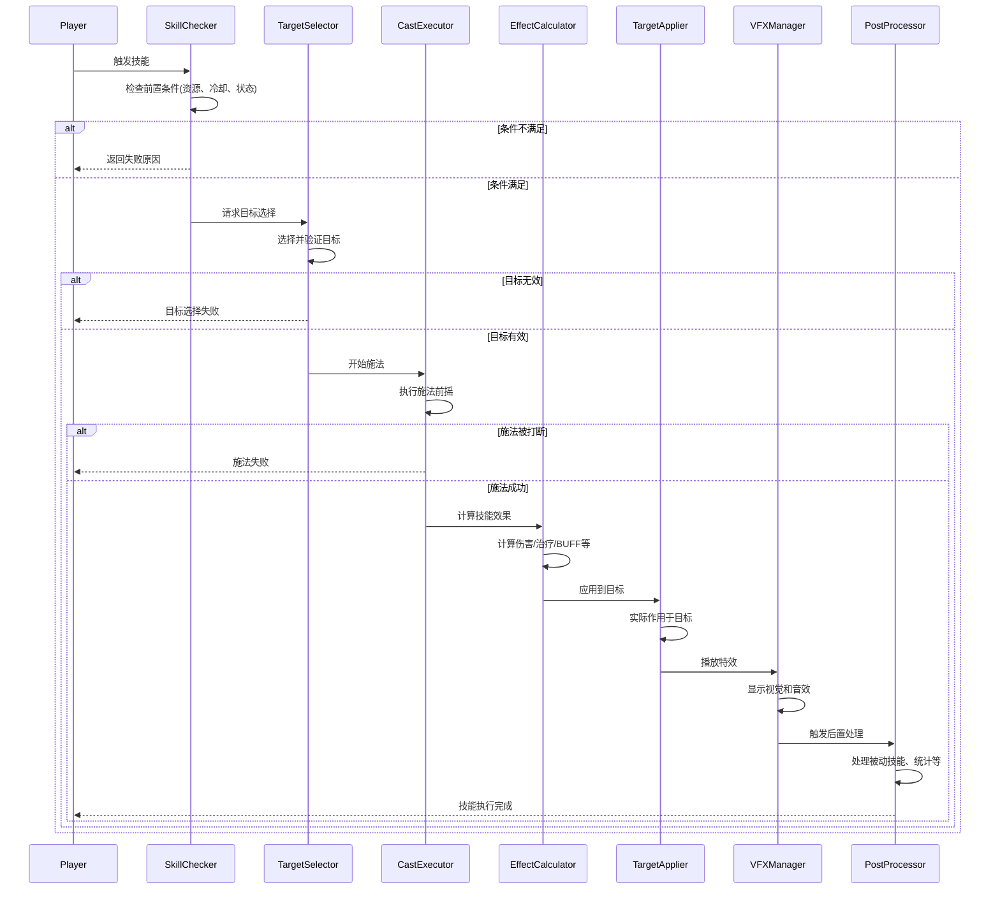

## 6. 技能系统核心总结

### 6.1 技能的本质组成

技能系统由 **9个核心模块** 组成，每个模块都可以独立配置和组合：

1. **前置条件检查** - 整合验证资源、冷却、状态等所有前置要求
2. **目标选择验证** - 确定技能作用的目标并验证有效性
3. **施法前摇阶段** - 控制技能的施放过程和时机
4. **效果计算** - 计算技能的最终数值效果
5. **作用于目标** - 将计算好的效果实际应用到目标上
6. **特效表现** - 提供视觉和听觉反馈
7. **后置处理** - 处理技能产生的连锁反应
8. **状态更新** - 更新游戏状态和数据
9. **条件分支** - 处理不同的执行结果

### 6.2 关键修正说明

- **前置条件检查**：整合了资源消耗验证和冷却时间检查
- **作用于目标**：在效果计算和特效表现之间新增，负责实际执行效果
- **移除扩展功能**：简化为核心功能模块，扩展功能可通过组合实现

### 6.3 系统优势

- **逻辑清晰**: 验证→选择→执行→计算→应用→表现→处理的清晰流程
- **模块化设计**: 每个组件职责单一，易于维护
- **组合灵活性**: 9个模块可以产生数千种技能组合
- **扩展性强**: 新增功能只需修改对应模块
- **统一性**: 技能、物品、装备效果使用同一套系统

### 6.4 实际应用示例

**简单技能组合 (治疗药水):**

```
前置条件(有药水+血量<100%) → 目标选择(自身) → 施法前摇(瞬发) → 
效果计算(固定治疗值) → 作用于目标(恢复HP) → 特效表现(治疗光效) → 
后置处理(无) → 状态更新(扣除药水+HP增加)
```

**复杂技能组合 (连锁闪电):**

```
前置条件(MP100+冷却完毕+有敌人) → 目标选择(链式5个敌人) → 
施法前摇(吟唱1.5秒) → 效果计算(递减雷电伤害+麻痹几率) → 
作用于目标(造成伤害+施加麻痹DEBUFF) → 特效表现(闪电链特效) → 
后置处理(触发雷系被动) → 状态更新(扣除MP+设置冷却)
```

### 6.5 技术实现要点

1. **管道式执行**: 严格按顺序执行各个模块
2. **早期验证**: 在前置条件阶段完成所有验证
3. **效果分离**: 计算和应用分离，便于调试和扩展
4. **状态机管理**: 控制技能的执行状态
5. **数据驱动**: 配置文件控制技能行为

这套精简的9模块设计更加符合实际开发需求，既保持了完整性又避免了过度复杂化。

scriptFiles/game/
├── MainStorage/Code/                    # 客户端-服务端共享代码
│   ├── Common/
│   │   ├── Config/
│   │   │   ├── SkillTypeConfig.lua      # 技能配置(含物品技能和持续效果)
│   │   │   └── SkillConstants.lua       # 技能系统常量
│   │   ├── SkillCore/
│   │   │   ├── ComponentBase.lua        # 组件基类
│   │   │   ├── SkillTypes.lua           # 所有类型定义
│   │   │   └── SkillEvents.lua          # 客户端服务端通信事件
│   │   └── Utils/
│   │       └── SkillUtils.lua           # 技能工具函数
│   └── Client/
│       ├── ClientSkillManager.lua       # 客户端技能管理
│       ├── SkillVFXManager.lua          # 特效管理器
│       ├── SkillUIManager.lua           # 技能UI管理
│       └── SkillInputHandler.lua        # 技能输入处理
│
└── ServerStorage/
    ├── MSystems/
    │   └── Skill/                       # 技能玩家数据系统
    │       ├── SkillMgr.lua             # 技能功能管理器
    │       ├── SkillEventManager.lua    # 技能事件管理器
    │       ├── SkillCloudDataMgr.lua    # 技能云数据管理器
    │       ├── PlayerSkill.lua          # 玩家技能类
    │       └── SkillUtils.lua           # 技能工具函数
    │
    ├── SkillServer/                     # 服务端技能系统
    │   ├── SkillExecutor.lua            # 技能执行器(核心流水线)
    │   ├── Components/                  # 9大模块组件(每个模块一个文件)
    │   │   ├── PreConditionChecker.lua  # 模块1: 前置条件检查
    │   │   ├── TargetSelector.lua       # 模块2: 目标选择验证
    │   │   ├── CastExecutor.lua         # 模块3: 施法前摇阶段
    │   │   ├── EffectCalculator.lua     # 模块4: 效果计算
    │   │   ├── EffectApplicator.lua     # 模块5: 作用于目标(核心)
    │   │   ├── EffectPresenter.lua      # 模块6: 特效表现(服务端部分)
    │   │   ├── PostProcessor.lua        # 模块7: 后置处理
    │   │   ├── StateManager.lua         # 模块8: 状态更新
    │   │   └── BranchProcessor.lua      # 模块9: 条件分支
    │   ├── SkillRuntimeManager.lua      # 技能运行时管理
    │   └── SkillValidator.lua           # 安全验证和防作弊
    │
    └── PersistentServer/                # 持续效果系统
        ├── PersistentManager.lua        # 持续效果管理器
        ├── PersistentExecutor.lua       # 持续效果执行器(独立9模块循环)
        ├── Effects/                     # 具体持续效果实现
        │   ├── DOTEffect.lua            # 持续伤害效果
        │   ├── HOTEffect.lua            # 持续治疗效果
        │   └── BuffEffect.lua           # 增益/减益效果
        └── EffectPool.lua               # 持续效果对象池