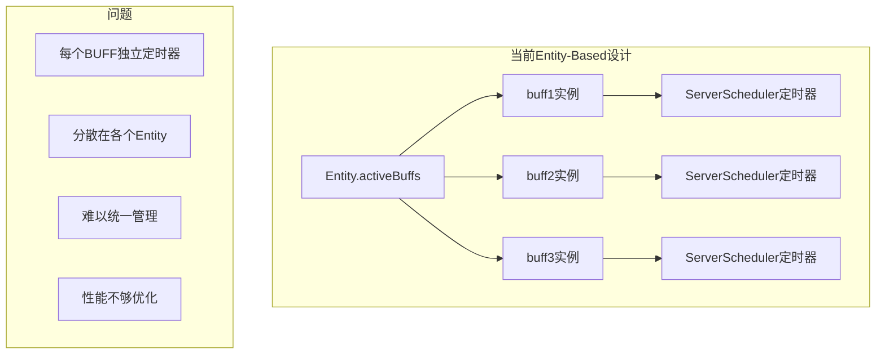
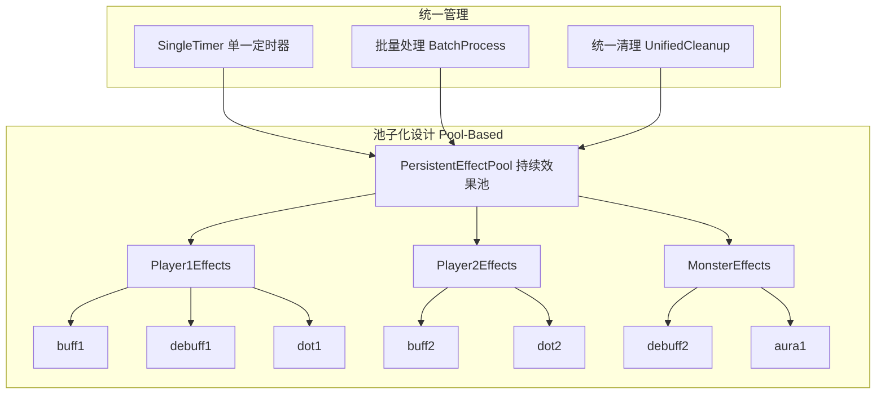
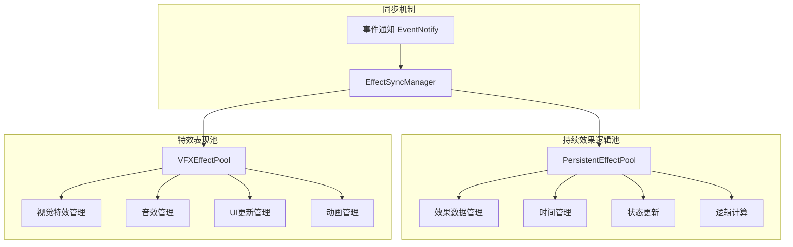
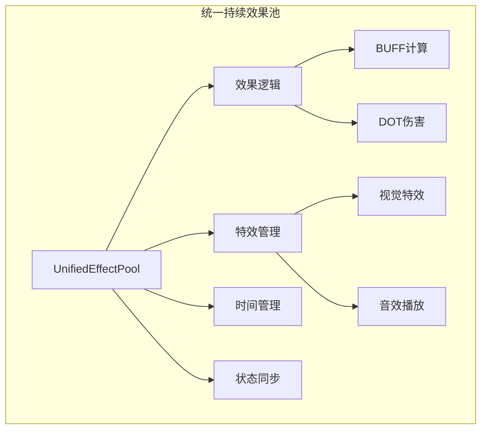
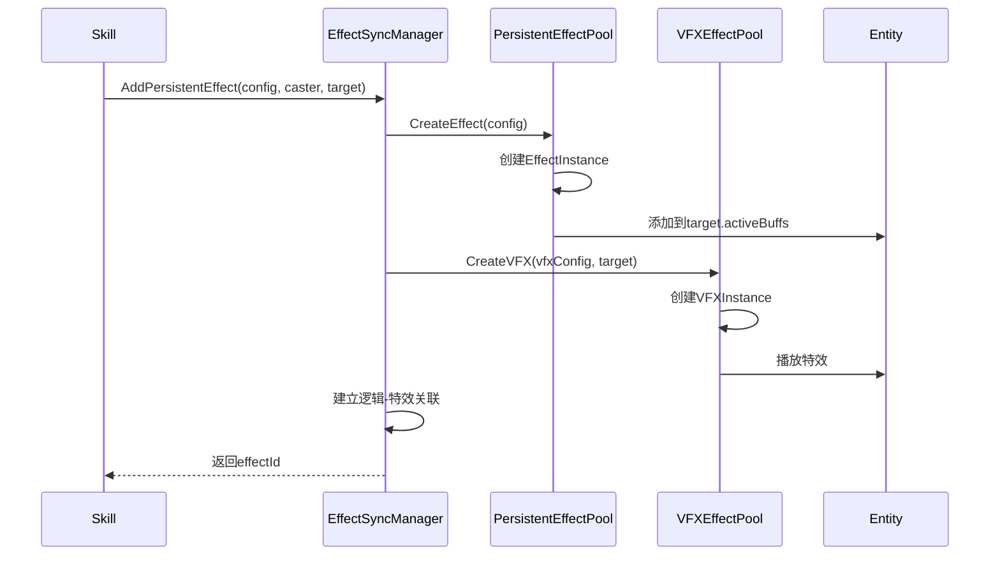
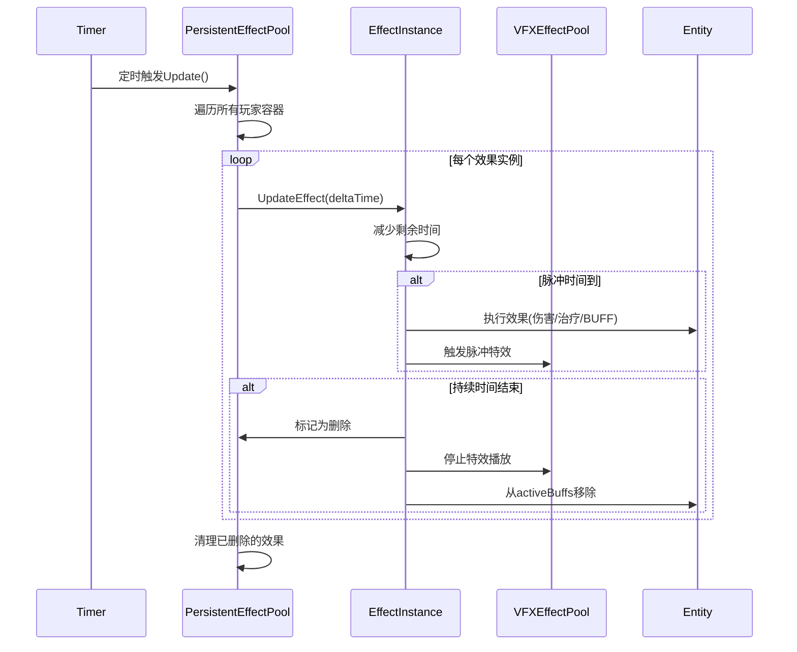
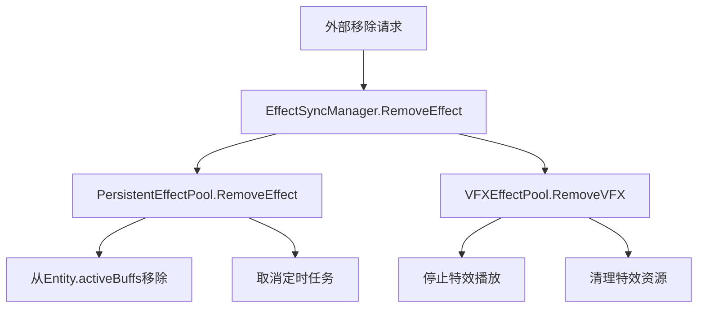

# 持续效果池子设计方案分析

## 1. 您的设计思路总结

您的核心想法：

- **持续效果池子**: 统一管理所有玩家的持续效果实例
- **定时任务器**: 定期检查和更新所有持续效果
- **自动清理**: 时间到期或外部消除时自动清理
- **特效管理**: 需要决定是否与持续效果池子分离

## 2. 从现有代码分析您的需求

### 2.1 当前的实现方式



### 2.2 您想要的池子设计



## 3. 池子设计方案对比

### 方案A：分离式设计（推荐）



**优势分析:**

- ✅ **职责分离**: 逻辑和表现分开，易于维护
- ✅ **性能优化**: 可以独立优化逻辑计算和特效渲染
- ✅ **扩展性**: 新增特效类型不影响逻辑池
- ✅ **网络友好**: 逻辑池在服务端，特效池可在客户端

### 方案B：一体式设计



**劣势分析:**

- ❌ **耦合度高**: 逻辑和表现混合，难以维护
- ❌ **性能问题**: 无法独立优化不同部分
- ❌ **扩展困难**: 修改任何部分都可能影响其他功能

## 4. 推荐的分离式架构设计

### 4.1 持续效果逻辑池

```lua
-- 持续效果逻辑池
---@class PersistentEffectPool
---@field playerEffects table<string, PlayerEffectContainer> 玩家效果容器
---@field updateTimer number 更新定时器ID
---@field updateInterval number 更新间隔(秒)
local PersistentEffectPool = {}

---@class PlayerEffectContainer
---@field playerId string 玩家ID
---@field effects table<string, EffectInstance> 效果实例列表
---@field lastUpdateTime number 上次更新时间
local PlayerEffectContainer = {}

---@class EffectInstance
---@field effectId string 效果ID
---@field effectType string 效果类型(BUFF/DEBUFF/DOT/HOT)
---@field caster Entity 施法者
---@field target Entity 目标
---@field remainingTime number 剩余时间
---@field pulseInterval number 脉冲间隔
---@field lastPulseTime number 上次脉冲时间
---@field stackCount number 叠加层数
---@field effectData table 效果数据
local EffectInstance = {}
```

### 4.2 特效表现池

```lua
-- 特效表现池
---@class VFXEffectPool
---@field activeVFX table<string, VFXInstance> 活跃特效实例
---@field vfxQueue table VFX播放队列
local VFXEffectPool = {}

---@class VFXInstance
---@field vfxId string 特效ID
---@field effectId string 关联的效果ID
---@field target Entity 目标实体
---@field vfxType string 特效类型(PARTICLE/SOUND/ANIMATION)
---@field isLooping boolean 是否循环
---@field remainingTime number 剩余时间
local VFXInstance = {}
```

### 4.3 同步管理器

```lua
-- 效果同步管理器
---@class EffectSyncManager
---@field logicPool PersistentEffectPool 逻辑池引用
---@field vfxPool VFXEffectPool 特效池引用
local EffectSyncManager = {}

-- 添加持续效果
function EffectSyncManager:AddPersistentEffect(effectConfig, caster, target)
    -- 1. 在逻辑池中创建效果实例
    local effectInstance = self.logicPool:CreateEffect(effectConfig, caster, target)
    
    -- 2. 在特效池中创建对应的特效实例
    if effectConfig.vfxConfig then
        local vfxInstance = self.vfxPool:CreateVFX(effectConfig.vfxConfig, target, effectInstance.effectId)
    end
    
    -- 3. 建立关联关系
    effectInstance.vfxId = vfxInstance and vfxInstance.vfxId or nil
    
    return effectInstance
end

-- 移除持续效果
function EffectSyncManager:RemovePersistentEffect(effectId, reason)
    -- 1. 从逻辑池移除
    local effectInstance = self.logicPool:RemoveEffect(effectId)
    
    -- 2. 从特效池移除对应特效
    if effectInstance and effectInstance.vfxId then
        self.vfxPool:RemoveVFX(effectInstance.vfxId, reason)
    end
end
```

## 5. 具体实现流程

### 5.1 添加持续效果流程



### 5.2 定时更新流程



### 5.3 外部移除流程



## 6. 优势总结

### 6.1 性能优势

- **批量处理**: 单一定时器处理所有持续效果，减少定时器开销
- **内存优化**: 池化管理，减少频繁的创建销毁
- **缓存友好**: 相同类型的效果放在一起，提高缓存命中率

### 6.2 管理优势

- **统一监控**: 可以轻松查看所有持续效果的状态
- **批量操作**: 支持批量清理、暂停、恢复等操作
- **调试友好**: 集中的日志和状态信息

### 6.3 扩展优势

- **逻辑特效分离**: 可以独立优化和扩展
- **类型扩展**: 易于添加新的持续效果类型
- **平台适配**: 特效池可以根据平台差异化实现

## 7. 最终建议

**强烈推荐使用分离式设计**：

1. **PersistentEffectPool**: 管理所有持续效果的逻辑计算
2. **VFXEffectPool**: 管理所有持续效果的特效表现
3. **EffectSyncManager**: 统一管理两个池子的同步

这样设计既满足了您的池化管理需求，又保持了良好的架构设计原则，是最佳的解决方案。