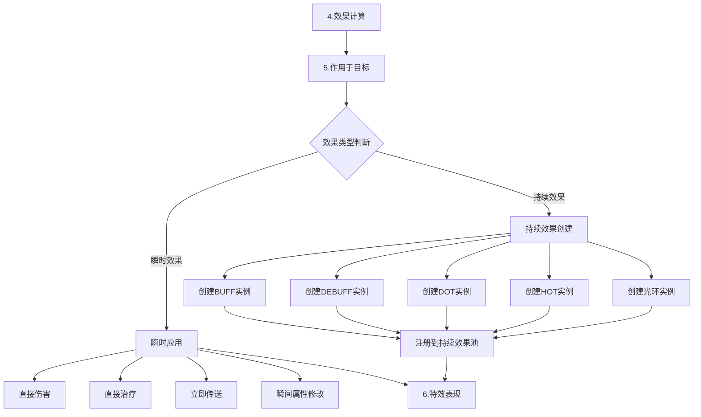
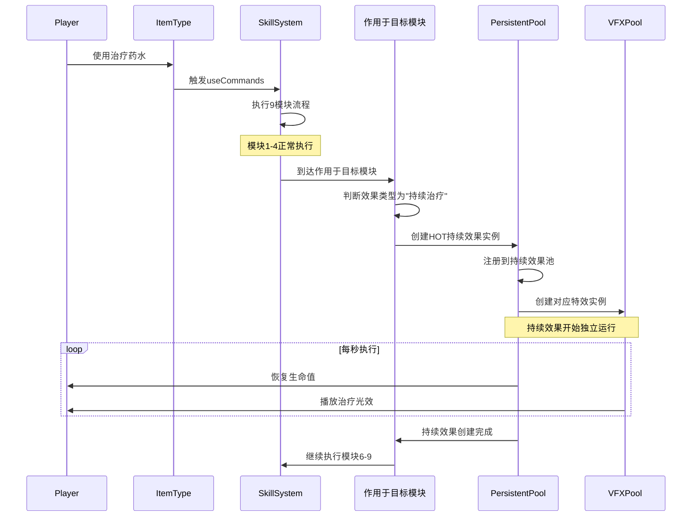
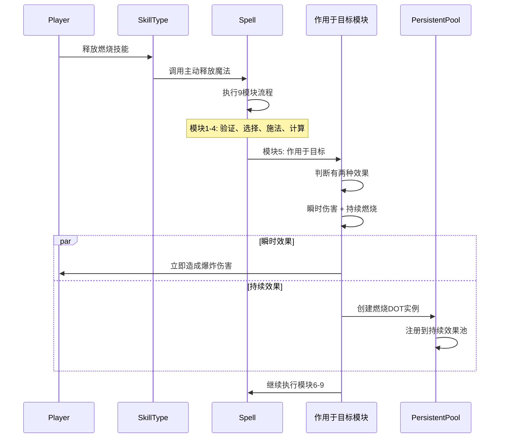
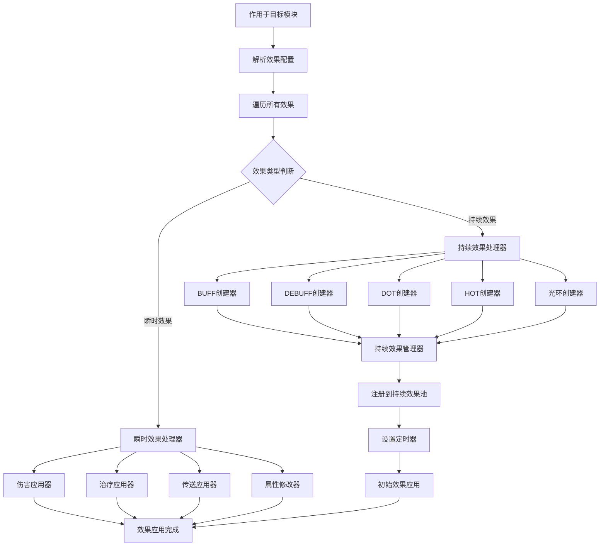
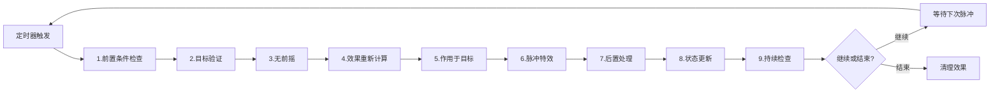

# 持续效果融入新技能架构的设计

## 1. 持续效果在9模块架构中的集成点

### 1.1 关键集成位置：模块5「作用于目标」



## 2. 技能/物品释放的完整流程

### 2.1 物品使用释放持续效果



### 2.2 技能释放持续效果



## 3. 模块5「作用于目标」的详细设计

### 3.1 作用于目标模块的内部流程



### 3.2 技能配置中的效果定义

```lua
-- 燃烧法术技能配置
BurningSpell = {
    skillId = "burning_spell",
    skillName = "燃烧法术",
    components = {
        -- 模块1-4: 前置条件、目标选择、施法前摇、效果计算
        
        -- 模块5: 作用于目标
        {
            componentType = "TargetApplication",
            effects = {
                -- 瞬时效果：立即爆炸伤害
                {
                    effectType = "INSTANT",
                    applicationType = "DAMAGE",
                    damageType = "FIRE",
                    value = 200
                },
                
                -- 持续效果：燃烧DOT
                {
                    effectType = "PERSISTENT",
                    applicationType = "DOT",
                    persistentConfig = {
                        dotType = "BURNING",
                        duration = 5.0,
                        pulseInterval = 1.0,
                        damagePerPulse = 50,
                        stackType = "REFRESH",
                        maxStacks = 3
                    }
                }
            }
        },
        
        -- 模块6-9: 特效表现、后置处理、状态更新、条件分支
    ]
}

-- 治疗药水物品配置
HealingPotion = {
    itemId = "healing_potion",
    itemName = "治疗药水",
    useCommands = {
        -- 使用药水时触发的技能
        skillId = "healing_potion_effect",
        components = {
            -- 模块5: 作用于目标
            {
                componentType = "TargetApplication",
                effects = {
                    -- 持续效果：持续治疗
                    {
                        effectType = "PERSISTENT",
                        applicationType = "HOT",
                        persistentConfig = {
                            hotType = "HEALING",
                            duration = 10.0,
                            pulseInterval = 1.0,
                            healPerPulse = 30,
                            stackType = "STACK",
                            maxStacks = 5
                        }
                    }
                }
            }
        }
    }
}
```

## 4. 持续效果的独立9模块循环

### 4.1 持续效果池的执行循环



### 4.2 持续效果管理器的设计

```lua
-- 持续效果管理器
---@class PersistentEffectManager
local PersistentEffectManager = {}

-- 在模块5中创建持续效果
function PersistentEffectManager:CreateFromSkill(skillEffect, caster, target, param)
    local persistentConfig = skillEffect.persistentConfig
    
    -- 创建持续效果实例
    local effectInstance = {
        effectId = gg.generateId(),
        effectType = persistentConfig.dotType or persistentConfig.hotType,
        caster = caster,
        target = target,
        duration = persistentConfig.duration,
        pulseInterval = persistentConfig.pulseInterval,
        remainingTime = persistentConfig.duration,
        lastPulseTime = 0,
        
        -- 继承原技能的9模块配置
        skillConfig = self:InheritSkillModules(skillEffect),
        param = param
    }
    
    -- 注册到持续效果池
    self:RegisterEffect(effectInstance)
    
    -- 立即执行第一次效果
    self:ExecuteEffectCycle(effectInstance)
    
    return effectInstance
end

-- 执行持续效果的9模块循环
function PersistentEffectManager:ExecuteEffectCycle(effectInstance)
    local success = true
    
    -- 模块1: 前置条件检查
    success = self:CheckPersistentConditions(effectInstance)
    if not success then
        self:RemoveEffect(effectInstance.effectId)
        return
    end
    
    -- 模块2: 目标验证
    success = self:ValidateTarget(effectInstance)
    if not success then
        self:RemoveEffect(effectInstance.effectId)
        return
    end
    
    -- 模块3: 无前摇 (持续效果通常无前摇)
    
    -- 模块4: 效果重新计算
    local effectValue = self:RecalculateEffect(effectInstance)
    
    -- 模块5: 作用于目标
    self:ApplyPersistentEffect(effectInstance, effectValue)
    
    -- 模块6: 脉冲特效
    self:PlayPulseVFX(effectInstance)
    
    -- 模块7: 后置处理
    self:ProcessPersistentPostEffects(effectInstance)
    
    -- 模块8: 状态更新
    self:UpdatePersistentState(effectInstance)
    
    -- 模块9: 持续检查
    local shouldContinue = self:CheckContinueConditions(effectInstance)
    if not shouldContinue then
        self:RemoveEffect(effectInstance.effectId)
    end
end
```

## 5. 实际应用示例

### 5.1 燃烧法术的完整流程

```
玩家释放燃烧法术
↓
1. 前置条件检查(MP足够、冷却完毕)
2. 目标选择验证(选择敌人)
3. 施法前摇阶段(吟唱1.5秒)
4. 效果计算(爆炸伤害200 + DOT伤害50/秒)
5. 作用于目标:
   ├─ 瞬时效果: 立即造成200火焰伤害
   └─ 持续效果: 创建燃烧DOT实例
6. 特效表现(火焰爆炸特效)
7. 后置处理(触发火系被动技能)
8. 状态更新(扣除MP、设置冷却)
9. 条件分支(技能释放成功)

持续效果独立循环:
每1秒执行一次燃烧DOT的9模块循环
├─ 检查目标是否存活
├─ 重新计算燃烧伤害
├─ 造成50点火焰伤害
├─ 播放燃烧特效
└─ 检查是否持续(5秒后结束)
```

### 5.2 治疗药水的完整流程

```
玩家使用治疗药水
↓
1. 前置条件检查(有药水、血量未满)
2. 目标选择验证(选择自身)
3. 施法前摇阶段(瞬发)
4. 效果计算(持续治疗30/秒)
5. 作用于目标:
   └─ 持续效果: 创建治疗HOT实例
6. 特效表现(治疗光环特效)
7. 后置处理(无)
8. 状态更新(消耗药水)
9. 条件分支(使用成功)

持续效果独立循环:
每1秒执行一次治疗HOT的9模块循环
├─ 检查玩家是否存活
├─ 重新计算治疗量
├─ 恢复30点生命值
├─ 播放治疗脉冲特效
└─ 检查是否持续(10秒后结束)
```

## 6. 技术实现要点

### 6.1 在模块5中的集成点

1. **效果类型识别**: 通过配置中的`effectType`区分瞬时和持续效果
2. **持续效果创建**: 为持续效果创建独立的实例和管理器
3. **9模块继承**: 持续效果继承原技能的配置，形成自己的9模块循环
4. **生命周期管理**: 通过持续效果池统一管理所有持续效果

### 6.2 系统优势

1. **完美集成**: 持续效果无缝融入9模块架构
2. **统一流程**: 技能和物品使用同一套流程
3. **独立管理**: 持续效果有自己的生命周期，不影响原技能
4. **高度灵活**: 支持复杂的持续效果组合

这样设计让持续效果完美融入您的新技能架构，既保持了系统的一致性，又提供了强大的扩展能力！