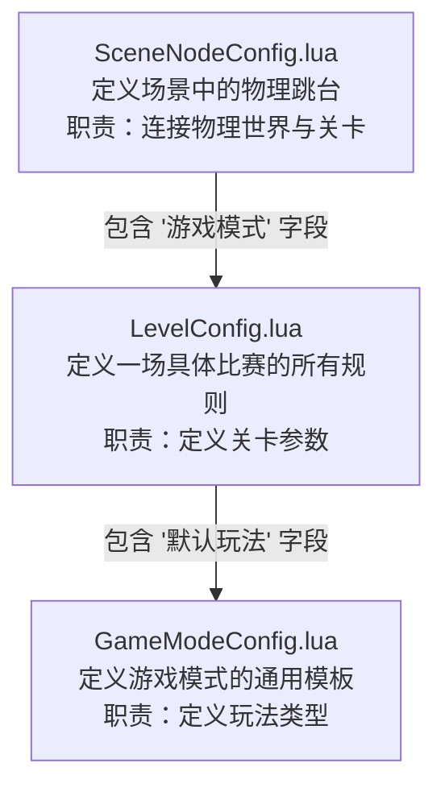
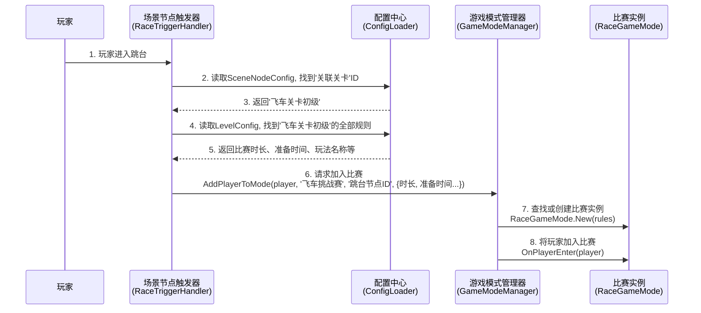

# 摩托飞车玩法实现方案

## 1. 核心设计思路

本方案旨在为游戏实现一套可复用、可扩展的飞车挑战赛玩法。其核心设计思想是**配置与逻辑分离**：

- **玩法逻辑**：由统一的 `RaceGameMode.lua` 脚本负责，它包含比赛的状态机（准备、进行、结束）、计时、胜负判断等核心逻辑。
- **关卡配置**：由专门的 `LevelConfig.lua` 文件负责。关卡设计师可以在此文件中定义每一场具体比赛的规则，如比赛时长、准备时间、奖励等，而无需修改任何代码。
- **场景入口**：由场景中的物理节点（如一个跳台）作为玩家进入特定关卡的入口，并在 `SceneNodeConfig.lua` 中将该节点与一个具体的关卡配置关联起来。

这种方式可以确保玩法逻辑的高度复用，同时给予关卡设计最大的灵活性。

## 2. 数据与配置流转

整个系统围绕三个核心配置文件协同工作，数据流向清晰：

- **`GameModeConfig.lua`**: **玩法模板库**。只定义游戏模式的通用信息，如 "飞车挑战赛" 的名字、描述等。
- **`LevelConfig.lua`**: **具体关卡规则库**。定义一个关卡的具体参数，如比赛时长、准备时间、最少/最多人数、奖励规则等。它通过 `['默认玩法']` 字段来指定它要使用 `GameModeConfig` 中的哪一个模板。
- **`SceneNodeConfig.lua`**: **场景节点配置库**。定义场景中的物理实体。它通过 `['游戏模式']` 字段来指定当这个节点被触发时，应该加载 `LevelConfig` 中的哪一个关卡。

## 3. 执行流程

当一个玩家开始一场飞车挑战赛时，系统后台的执行流程如下：

1.  **触发**：玩家的角色触碰到一个作为入口的场景节点（飞车跳台）。
2.  **关联查询**：绑定在该节点上的 `Handler` 脚本被触发。它首先查询 `SceneNodeConfig.lua`，获取到该节点所关联的**关卡ID**（例如 '飞车关卡初级'）。
3.  **规则查询**：`Handler` 接着使用这个关卡ID，去 `LevelConfig.lua` 中查询，从而获得这场比赛所有具体的规则（`比赛时长`, `准备时间`, `默认玩法`名称等）。
4.  **请求加入**：`Handler` 将玩家信息、从`LevelConfig`中查到的玩法名称(`'飞车挑战赛'`)、场景节点的唯一ID（作为比赛实例的ID）以及所有具体的玩法规则，一并传递给 `GameModeManager` 的 `AddPlayerToMode` 方法。
5.  **实例化与执行**：
    - `GameModeManager` 根据场景节点的唯一ID，查找是否已存在对应的比赛实例。
    - 如果不存在，它会根据玩法名称（`'飞车挑战赛'`）找到对应的 `RaceGameMode` 类，并调用 `New()` 方法创建一个新的比赛实例，同时将具体的玩法规则（时长、准备时间等）作为参数传递给构造函数 `OnInit`。
    - `RaceGameMode` 实例被创建后，用这些参数来初始化自身的比赛逻辑，例如启动一个指定时长的倒计时。
    - `GameModeManager` 最终将玩家加入这个刚刚创建或已存在的比赛实例中。

## 4. 系统优势

- **高内聚，低耦合**：玩法逻辑、关卡参数、场景入口三者分离，各司其职。
- **可复用性强**：同一套 `RaceGameMode` 逻辑，可以通过 `LevelConfig` 配置出无数个规则各异的关卡。
- **易于维护**：关卡设计师可以在不接触代码的情况下，通过修改 `LevelConfig` 和 `SceneNodeConfig` 来增加、删除或调整关卡。
- **扩展性好**：未来如果需要新增一种"夺旗赛"玩法，只需新增一个 `CaptureTheFlagMode.lua`，并在 `GameModeConfig` 和 `LevelConfig` 中增加相应配置即可，无需改动现有系统。 