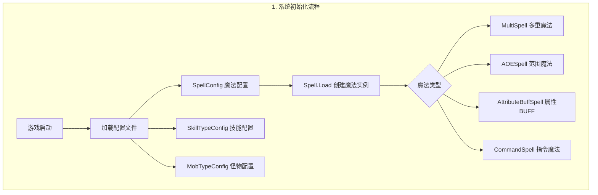
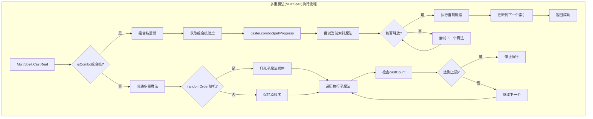
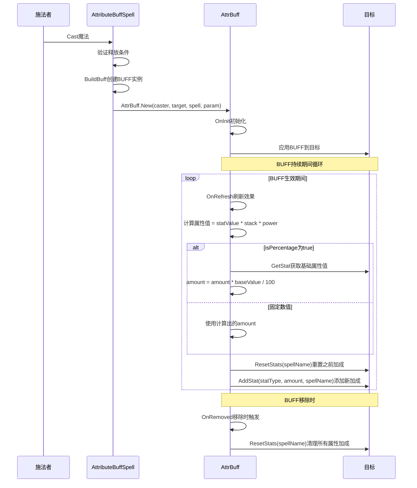
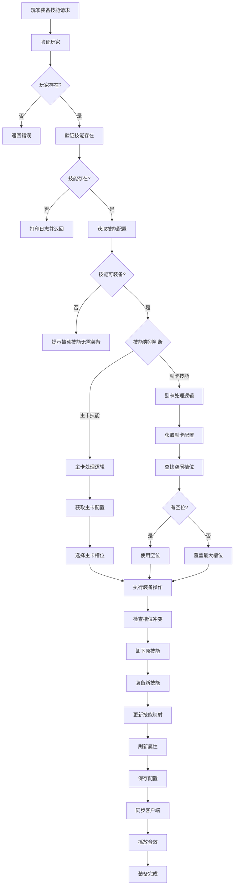
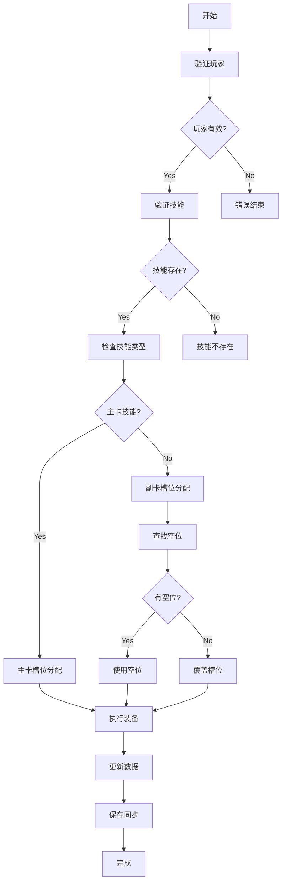
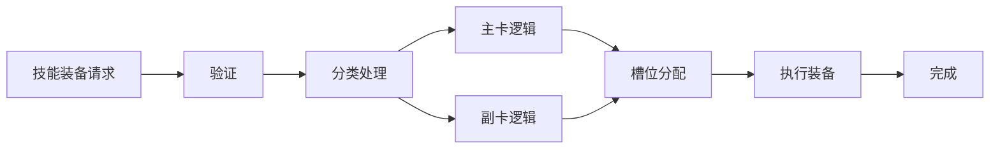
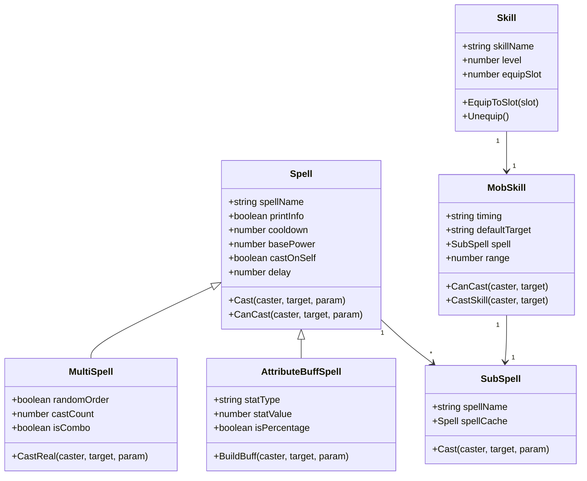

# 法术魔法系统完整流程图文档

## 1. 系统整体架构流程

## 2. 多重魔法(MultiSpell)执行流程

## 3. 属性BUFF魔法系统流程

## 4. 技能装备系统完整流程

### 备选方案 - 使用graph语法：

### 最简版本：

## 5. 怪物技能系统详细流程

```mermaid
graph TB
    subgraph "怪物技能系统完整流程"
        MS1[怪物生成] --> MS2[MobType.OnInit初始化]
        MS2 --> MS3[读取怪物配置数据]
        MS3 --> MS4{技能配置存在 data.技能?}
        MS4 -->|否| MS5[无技能怪物]
        MS4 -->|是| MS6[遍历技能配置]
        
        MS6 --> MS7[创建MobSkill实例]
        MS7 --> MS8[解析技能参数]
        
        subgraph "技能参数解析"
            MS8 --> MS9[timing: 触发时机]
            MS8 --> MS10[defaultTarget: 默认目标类型]
            MS8 --> MS11[魔法: SubSpell配置]
            MS8 --> MS12[range: 施法距离]
        end
        
        MS9 --> MS13[按timing分类存储 triggerSkills]
        MS10 --> MS13
        MS11 --> MS14[SubSpell.New创建子魔法]
        MS12 --> MS13
        MS14 --> MS13
        
        MS13 --> MS15[怪物进入战斗]
        MS15 --> MS16[根据时机触发技能]
        MS16 --> MS17{周期触发?}
        MS17 -->|是| MS18[定时器触发]
        MS17 -->|否| MS19[事件触发]
        
        MS18 --> MS20[MobSkill.CanCast检查]
        MS19 --> MS20
        
        subgraph "技能释放检查"
            MS20 --> MS21{目标存在?}
            MS21 -->|否| MS22[无法释放]
            MS21 -->|是| MS23[距离检查]
            MS23 --> MS24{距离满足 range?}
            MS24 -->|否| MS25[距离不够]
            MS24 -->|是| MS26[SubSpell.CanCast检查]
            MS26 --> MS27{子魔法可释放?}
            MS27 -->|否| MS28[条件不满足]
            MS27 -->|是| MS29[可以释放]
        end
        
        MS29 --> MS30[MobSkill.CastSkill执行]
        
        subgraph "技能执行逻辑"
            MS30 --> MS31{施法者状态检查}
            MS31 -->|已死亡或冻结| MS32[无法释放]
            MS31 -->|正常| MS33[确定技能目标]
            MS33 --> MS34{目标类型}
            MS34 -->|目标| MS35[使用caster.target]
            MS34 -->|自己| MS36[使用caster自身]
            MS34 -->|其他| MS37[使用传入目标]
            MS35 --> MS38[SubSpell.Cast执行子魔法]
            MS36 --> MS38
            MS37 --> MS38
            MS38 --> MS39[技能释放完成]
        end
    end
```

## 6. 魔法配置数据结构关系图

## 系统总结

### 核心特点

1. **配置驱动架构** - 通过SpellConfig、SkillTypeConfig等配置文件定义行为
2. **模块化设计** - Spell、SubSpell、MobSkill等组件各司其职
3. **完整的条件检查** - 距离、冷却、释放条件等多重验证
4. **灵活的目标系统** - 支持自动目标选择和多种目标类型
5. **特效集成** - 前摇、释放、目标特效的完整支持
6. **技能装备管理** - 主卡/副卡的自动槽位分配
7. **怪物AI集成** - 支持多种触发时机的智能技能释放

### 技术架构优势

- **高可配置性**: 通过配置文件控制所有魔法行为
- **易扩展性**: 新魔法类型可通过继承Spell基类轻松添加
- **性能优化**: SubSpell缓存机制减少重复加载
- **状态管理**: 完整的BUFF系统和属性管理
- **事件驱动**: 灵活的魔法触发和响应机制