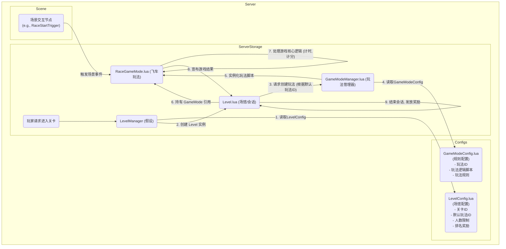

# 关卡 (Level) 与玩法 (GameMode) 系统设计文档

## 1. 背景

为了支持更多样化的游戏模式（如飞车竞速），同时兼容现有的PVE闯关玩法，我们对原有的 `Level` 系统进行重构和扩展。

核心设计思想是 **将"游戏会话/场地"与"游戏规则"这两个概念进行解耦**。

- **关卡 (Level)**: 负责管理一个独立的 **游戏会话**，像一个"场馆"。
- **玩法 (GameMode)**: 负责定义一套具体的 **游戏规则**，像场馆里举办的"比赛项目"。

这种分离使得我们可以灵活地在任何"场馆"中举办不同的"比赛"，并且未来可以轻松地添加新的"比赛项目"而无需改动"场馆"本身。

## 2. 核心概念

### Level (关卡)
- **职责**: 管理一个游戏会话的生命周期。它不关心具体的游戏怎么玩，只关心 **谁在玩、玩多久、在哪里玩、结束后发什么奖励**。
- **具体工作**:
    - 管理玩家的加入与退出。
    - 管理游戏会话的开始与结束。
    - 加载和管理会话所需的地图与场景资源。
    - 根据自身的配置，在会话结束时为玩家发放奖励。
- **对应实现**: 重构后的 `ServerStorage/Level/Level.lua`。

### GameMode (玩法)
- **职责**: 定义一套具体、可复用的游戏规则。它不关心玩家是谁或从哪里来，只关心 **如何判定胜负、如何计分、以及如何处理玩法中的特定事件**。
- **具体工作**:
    - 定义胜利与失败的条件（例如：第一个到达终点、存活到最后、得分最高）。
    - 实现计分逻辑（例如：飞车比赛中根据飞行距离计分）。
    - 处理玩法相关的特定事件（例如：通过检查点、拾取道具）。
- **对应实现**:
    - `ServerStorage/GameModes/GameModeBase.lua`: 所有玩法的基类。
    - `ServerStorage/GameModes/Modes/RaceGameMode.lua`: 飞车竞速玩法的具体实现。

### GameModeManager (玩法管理器)
- **职责**: 作为一个工厂和调度中心，负责根据 `Level` 的请求，创建和管理相应的 `GameMode` 实例。
- **对应实现**: `ServerStorage/GameModes/GameModeManager.lua`。

## 3. 文件结构

根据我们的设计，推荐采用以下文件结构：

```
ServerStorage/
|-- Level/
|   |-- Level.lua           # 重构后的关卡（会话）管理器
|
|-- GameModes/
|   |-- GameModeManager.lua # 玩法管理器，负责创建和管理GameMode实例
|   |-- GameModeBase.lua    # 所有玩法的抽象基类
|   |-- Modes/
|       |-- RaceGameMode.lua    # [新] 飞车竞速玩法实现
|       |-- SurvivalMode.lua  # [未来] 可将现有PVE逻辑封装成一种玩法
```

## 4. 配置设计

配置同样遵循解耦的原则。

### `LevelConfig.lua` - "场馆"的配置
定义一个游戏场地的基础属性。

- **关键字段**:
    - `关卡ID`: 唯一的ID。
    - `关卡名称`: 用于UI显示。
    - `默认玩法ID`: **核心关联字段**。它告诉 `Level` 应该加载哪一套 `GameMode` 规则。
    - `最少人数`, `最多人数`: 进入该场地的玩家数量限制。
    - `排名奖励`: **奖励与场地挂钩**。这样同一套竞速玩法用在不同难度的赛道（不同的Level）时，可以给予不同的奖励。

### `GameModeConfig.lua` (新) - "规则"的配置
定义一套游戏玩法的具体规则。

- **关键字段**:
    - `玩法ID`: 唯一的ID，用于被 `LevelConfig` 引用。
    - `玩法名称`: 用于UI显示或日志记录。
    - `玩法逻辑脚本`: **核心关联字段**。指向该玩法逻辑的实现文件路径（例如 `GameModes/Modes/RaceGameMode.lua`）。
    - `玩法规则`: 一个 `table`，包含该玩法所需的所有可配置参数。

- **飞车竞速玩法规则示例 (`玩法规则` table):**
  ```lua
  玩法规则 = {
      比赛时长 = 300,        -- 单位：秒
      准备时间 = 15,         -- 游戏开始前的准备倒计时
      入口节点名 = "RaceStartTrigger", -- 对应SceneNodeConfig中的起点触发器
      结束区域名 = "RaceFinishLine", -- 对应SceneNodeConfig中的终点区域
      每米得分 = 1,
      胜利条件 = { type = "rank", count = 1 }, -- 定义胜利条件为排名第一
  }
  ```

### `SceneNodeConfig.lua`
保持不变。它定义了场景中的物理交互节点（如触发器、交互区域），作为连接**物理场景**和**游戏逻辑**的桥梁。`GameMode` 将通过其配置的节点名来监听场景事件。

## 5. 工作流程与交互



**流程描述:**
1.  玩家请求开始一个 `Level`。
2.  `LevelManager` (或现有等效系统) 根据 `LevelConfig.lua` 的配置，创建一个 `Level` 实例，并开始管理玩家进入流程。
3.  `Level` 实例被激活后，它会读取自身的 `默认玩法ID` 配置。
4.  `Level` 实例向 `GameModeManager` 请求创建一个对应 `玩法ID` 的 `GameMode` 实例。
5.  `GameModeManager` 查找 `GameModeConfig.lua`，找到该 `玩法ID` 对应的 `玩法逻辑脚本` 路径和 `玩法规则` 数据。
6.  `GameModeManager` 加载脚本文件，实例化 `GameMode`，并将 `玩法规则` 和 `Level` 实例的引用传递给它（`GameMode` 需要通过 `Level` 实例来获取玩家列表等会话信息）。
7.  `Level` 负责启动整个会话（例如开始准备倒计时），之后将主要的游戏逻辑（如比赛计时、胜负判断）全权委托给持有的 `GameMode` 实例处理。
8.  `GameMode` 实例通过监听场景事件和内部逻辑，独立运行。当满足胜利或失败条件时，它会通知 `Level` 实例。
9.  `Level` 实例收到游戏结束的通知后，负责结束整个会话，并根据自身的 `排名奖励` 配置为玩家发放奖励，然后销毁。

## 6. 玩家状态
为了处理特定玩法中的细节，需要在 `MPlayer` 对象上增加相应的状态。例如，在飞车竞速中，为了区分玩家是**正常降落在赛道上**还是**失误坠毁在赛道上**，可以引入一个状态：

`player.movementState = "flying_in_race"`

当 `GameMode` 开始时，为所有参与的玩家设置此状态。这样，触碰检测逻辑就可以根据这个状态来执行正确的行为。 