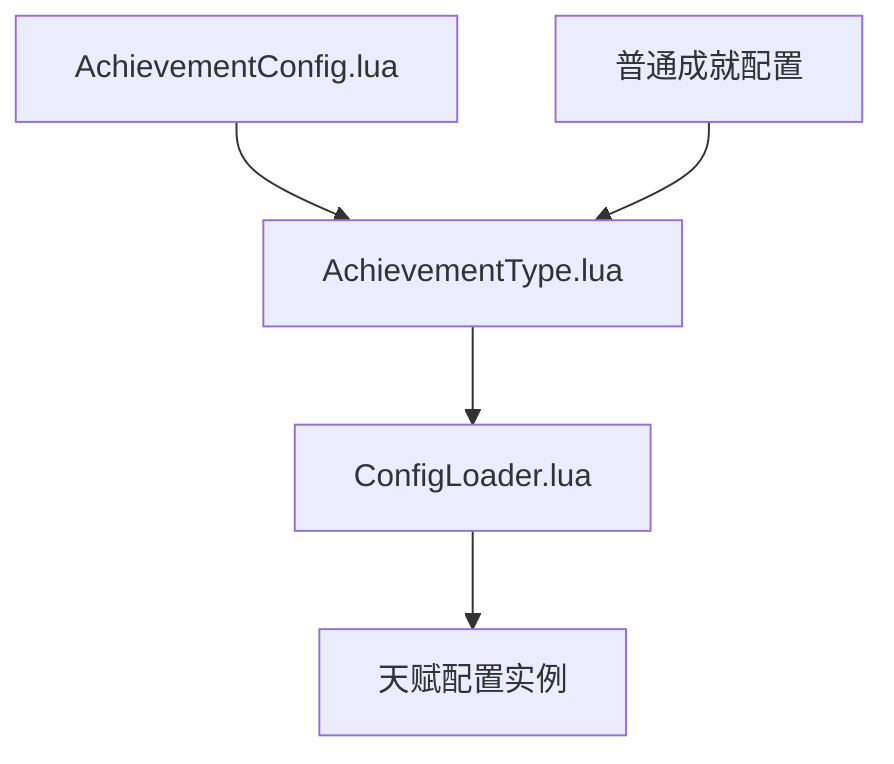
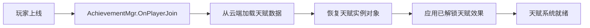
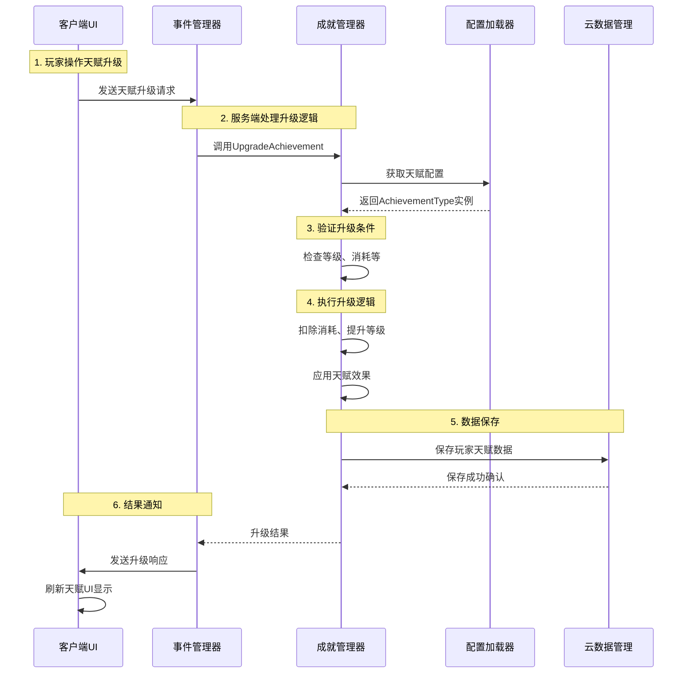
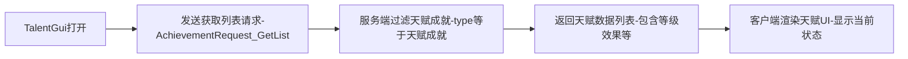
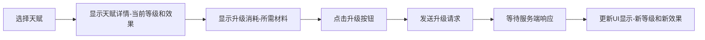

# 基于成就系统的天赋架构完整分析

## 概述

本文档详细分析了项目中天赋系统的真实实现架构。经过深入调研发现，天赋系统是基于成就系统实现的，这是一个非常巧妙的设计方案。天赋实际上是特殊类型的成就（`天赋成就`），复用了成就系统的数据管理、升级逻辑和效果应用机制。

## 1. 核心架构概览

### 1.1 文件结构映射

```
天赋系统核心文件:
├── 配置层
│   ├── MainStorage/Code/Common/Config/AchievementConfig.lua     # 天赋原始配置
│   └── MainStorage/Code/Common/TypeConfig/AchievementType.lua   # 天赋类型定义
├── 服务端逻辑层
│   ├── ServerStorage/MSystems/Achievement/AchievementMgr.lua         # 天赋管理器
│   ├── ServerStorage/MSystems/Achievement/AchievementEventManager.lua # 天赋事件管理
│   ├── ServerStorage/MSystems/Achievement/Achievement.lua            # 天赋实例类
│   └── ServerStorage/MSystems/Achievement/AchievementCloudDataMgr.lua # 云数据管理
├── 客户端界面层
│   └── StarterGui/ClientUiMain/Talent/TalentGui.lua            # 天赋UI界面
└── 事件通信层
    └── MainStorage/Code/Event/AchievementEvent.lua             # 事件配置
```

### 1.2 天赋与成就的区分机制

天赋系统通过在成就配置中设置特殊标识来区分：

- **普通成就**: `类型 = "普通成就"`, `最大等级 = 1`（或nil）
- **天赋成就**: `类型 = "天赋成就"`, `最大等级 > 1`

## 2. 配置层：数据驱动的天赋定义

### 2.1 天赋配置结构分析

以"重生"天赋为例，在 `AchievementConfig.lua` 中的定义：

```lua
['重生'] = {
    ['名字'] = '重生',                    -- 天赋唯一ID
    ['类型'] = '天赋成就',                -- 标识为天赋类型
    ['描述'] = '重生栏位',                -- 天赋描述
    ['图标'] = '',                       -- 天赋图标路径
    ['最大等级'] = 20,                   -- 支持20级升级
    ['升级条件'] = {                     -- 升级消耗定义
        {
            ['消耗物品'] = '奖杯',
            ['消耗数量'] = '',            -- 支持公式化计算
        }
    },
    ['等级效果'] = {                     -- 等级效果定义
        {
            ['效果类型'] = '玩家变量',
            ['效果字段名称'] = '解锁_重生',
            ['效果数值'] = 'T_LVL*2+1',   -- 基于等级的公式
            ['效果描述'] = '重生栏位增加，T_LVL是天赋等级',
        },
    },
}
```

### 2.2 配置加载流程



## 3. 服务端逻辑层：天赋管理核心

### 3.1 数据管理结构

服务端通过 `AchievementMgr` 统一管理所有玩家的天赋数据：

```lua
-- 数据存储结构
AchievementMgr = {
    server_player_achievement_data = {
        [playerId] = {
            [talentId] = Achievement实例  -- 天赋实际存储为Achievement对象
        }
    }
}
```

### 3.2 天赋生命周期管理

#### 玩家上线时的天赋数据加载



#### 天赋解锁流程

```lua
-- 解锁天赋（实际上是解锁天赋成就）
AchievementMgr.UnlockAchievement(player, "重生", 1)  -- 初始等级为1
```

#### 天赋升级流程

```lua
-- 升级天赋
AchievementMgr.UpgradeAchievement(player, "重生")  -- 从当前等级+1
```

## 4. 客户端与服务端交互流程

### 4.1 完整的天赋升级交互时序



### 4.2 网络事件定义

天赋系统复用成就系统的事件通信机制：

```lua
-- 客户端请求事件
AchievementEventConfig.REQUEST = {
    GET_LIST = "AchievementRequest_GetList",                    -- 获取天赋列表
    UPGRADE_TALENT = "AchievementRequest_UpgradeTalent",        -- 升级天赋
    GET_UPGRADE_PREVIEW = "AchievementRequest_GetUpgradePreview", -- 升级预览
}

-- 服务端响应事件
AchievementEventConfig.RESPONSE = {
    UPGRADE_RESPONSE = "AchievementResponse_Upgrade",           -- 升级响应
    PREVIEW_RESPONSE = "AchievementResponse_Preview",           -- 升级预览响应
}
```

## 5. 天赋效果系统

### 5.1 效果类型与应用机制

天赋效果通过 `Achievement:ApplyEffects()` 方法应用到玩家身上：

#### 玩家变量效果

```lua
-- 应用到玩家变量系统
player.variableSystem:SetVariable("解锁_重生", effectValue)
```

#### 玩家属性效果

```lua
-- 应用到玩家属性系统
player:AddStat("攻击力", effectValue, "ACHIEVEMENT_重生", true)
```

### 5.2 公式化效果计算

天赋效果支持基于等级的公式计算，由 `AchievementRewardCal` 处理：

```lua
-- 效果公式示例：'T_LVL*2+1'
-- 等级1: 1*2+1 = 3
-- 等级5: 5*2+1 = 11
-- 等级20: 20*2+1 = 41

function AchievementType:EvaluateEffectFormula(formula, level)
    local expression = string.gsub(formula, "T_LVL", tostring(level))
    local func = load("return " .. expression)
    return func()
end
```

## 6. 客户端UI层实现

### 6.1 天赋界面组件结构

基于提供的UI截图分析，`TalentGui.lua` 包含以下关键组件：

```lua
-- UI组件结构
TalentGui = {
    talentPanel,        -- 天赋主界面
    closeButton,        -- 关闭按钮
    talentSlotList,     -- 天赋栏位列表
    upgradeButton,      -- 升级按钮
    consumeSlotList,    -- 消耗材料栏位
    -- ... 其他UI组件
}
```

### 6.2 客户端数据获取流程



### 6.3 天赋升级UI交互



## 7. 数据持久化机制

### 7.1 云数据存储结构

天赋数据通过 `AchievementCloudDataMgr` 持久化到云端：

```lua
-- 云数据存储格式
playerTalentData = {
    achievements = {
        ["重生"] = {
            achievementId = "重生",
            playerId = "12345",
            unlockTime = 1640995200,    -- 解锁时间戳
            currentLevel = 5            -- 当前天赋等级
        }
    }
}
```

### 7.2 自动保存机制

系统通过定时器定期保存所有玩家的天赋数据：

```lua
-- 每60秒自动保存一次
local saveTimer = SandboxNode.New("Timer", game.WorkSpace)
saveTimer.Delay = 60
saveTimer.Loop = true
saveTimer.Callback = SaveAllPlayerAchievements
```

## 8. 核心优势分析

### 8.1 架构优势

1. **统一管理**: 天赋和成就使用同一套数据管理系统，减少代码重复
2. **功能复用**: 成就系统的解锁、升级、效果应用机制直接用于天赋
3. **配置灵活**: 通过`类型`字段区分普通成就和天赋成就
4. **效果丰富**: 支持公式化的等级效果计算（如`T_LVL*2+1`）
5. **扩展性强**: 新增天赋只需在配置中添加`天赋成就`类型的条目

### 8.2 实现优势

1. **数据驱动**: 天赋行为完全由配置文件控制
2. **类型安全**: 通过TypeConfig提供强类型支持
3. **事件解耦**: 客户端与服务端通过事件系统通信
4. **云端同步**: 天赋数据自动同步到云端存储

## 9. 关键实现要点

### 9.1 天赋识别机制

```lua
-- 判断是否为天赋
function AchievementType:IsTalentAchievement()
    return self.type == "天赋成就" and self.maxLevel ~= nil
end
```

### 9.2 等级管理机制

```lua
-- 天赋升级检查
function Achievement:CanUpgrade(player)
    if not self:IsTalentAchievement() then
        return false
    end
    
    if self.currentLevel >= self.achievementType:GetMaxLevel() then
        return false
    end
    
    -- 检查升级条件...
    return true
end
```

### 9.3 效果应用机制

```lua
-- 应用天赋效果
function Achievement:ApplyEffects(player)
    local effects = self.achievementType.levelEffects
    for _, effect in ipairs(effects) do
        local effectValue = self.achievementType:CalculateEffectValue(
            self.currentLevel, effect
        )
        -- 应用到对应系统...
    end
end
```

## 10. 总结

这个基于成就系统的天赋架构设计非常巧妙，通过复用成就系统的基础设施实现了完整的天赋功能。该架构具有以下特点：

- **高度统一**: 天赋和成就在底层使用相同的数据结构和管理逻辑
- **配置驱动**: 通过简单的配置就能定义复杂的天赋行为
- **扩展灵活**: 新增天赋类型或效果只需修改配置文件
- **性能优化**: 复用现有系统避免了重复开发和维护成本

这种设计体现了项目的KISS（Keep It Simple, Stupid）原则，在保持功能完整性的同时最大化了代码的复用性和维护性。