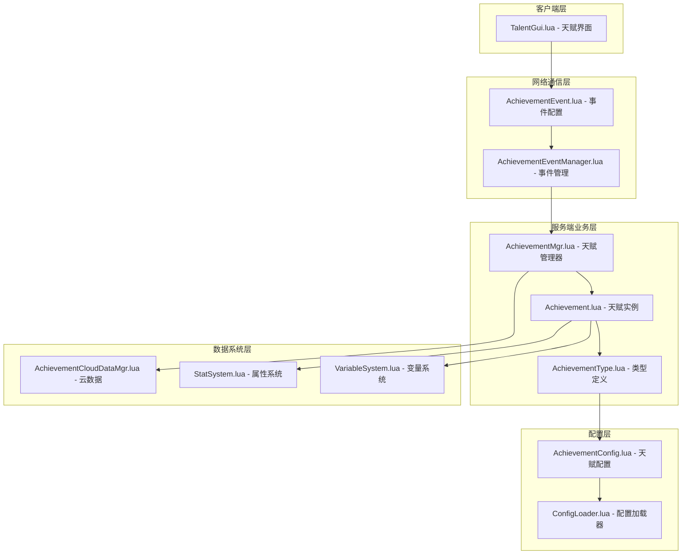
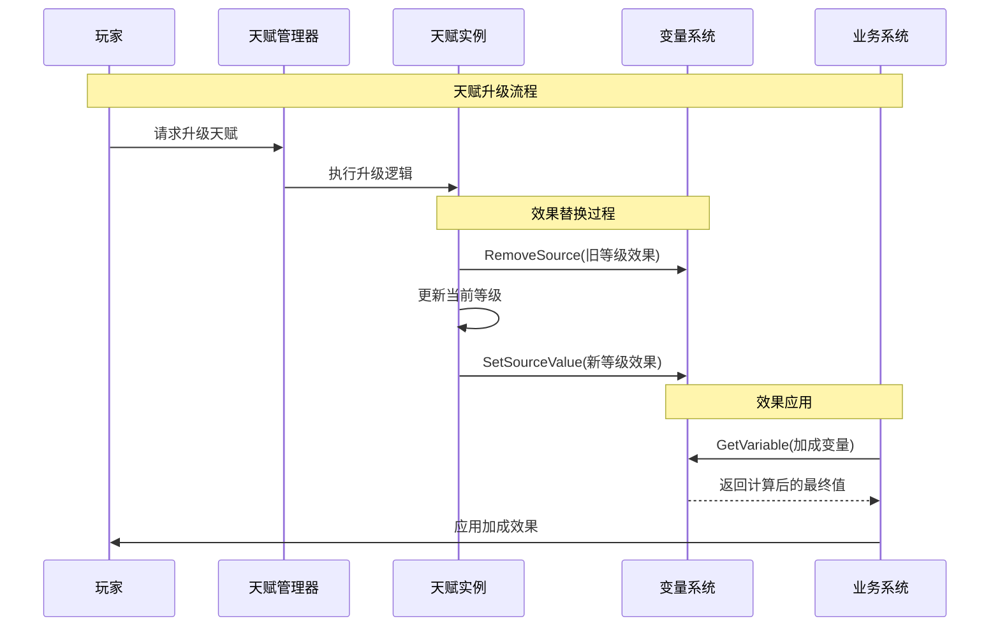

# 天赋系统与新VariableSystem整合设计文档

## 目录

- [1. 项目背景](https://claude.ai/chat/a448d0f5-4481-4be7-a5db-9183b4d27015#1-项目背景)
- [2. 整合目标](https://claude.ai/chat/a448d0f5-4481-4be7-a5db-9183b4d27015#2-整合目标)
- [3. 整体架构设计](https://claude.ai/chat/a448d0f5-4481-4be7-a5db-9183b4d27015#3-整体架构设计)
- [4. 核心组件改造](https://claude.ai/chat/a448d0f5-4481-4be7-a5db-9183b4d27015#4-核心组件改造)
- [5. 数据结构设计](https://claude.ai/chat/a448d0f5-4481-4be7-a5db-9183b4d27015#5-数据结构设计)
- [6. 业务系统集成](https://claude.ai/chat/a448d0f5-4481-4be7-a5db-9183b4d27015#6-业务系统集成)
- [7. 实施方案](https://claude.ai/chat/a448d0f5-4481-4be7-a5db-9183b4d27015#7-实施方案)
- [8. 数据流转示例](https://claude.ai/chat/a448d0f5-4481-4be7-a5db-9183b4d27015#8-数据流转示例)
- [9. 测试验证](https://claude.ai/chat/a448d0f5-4481-4be7-a5db-9183b4d27015#9-测试验证)
- [10. 总结与优势](https://claude.ai/chat/a448d0f5-4481-4be7-a5db-9183b4d27015#10-总结与优势)

------

## 1. 项目背景

### 1.1 现状分析

项目目前拥有基于成就系统实现的天赋架构，通过 `天赋成就` 类型复用成就系统的数据管理、升级逻辑和效果应用机制。同时，新设计的 `VariableSystem` 提供了强大的多来源变量管理能力，支持基础值+百分比的复杂计算。

### 1.2 存在问题

- 当前天赋效果应用使用简单的 `SetVariable/AddVariable` 接口
- 天赋升级时无法精确清理旧等级的效果
- 缺乏多来源效果叠加和溯源能力
- 百分比加成计算不够精确和灵活

### 1.3 整合价值

通过整合天赋系统与新 VariableSystem，可以实现：

- 精确的天赋效果管理和升级时的效果替换
- 强大的多来源效果叠加和计算能力
- 完整的效果来源追溯和调试支持
- 灵活的百分比与固定值混合计算

------

## 2. 整合目标

### 2.1 核心目标

| 目标           | 描述                             | 优先级 |
| -------------- | -------------------------------- | ------ |
| **向后兼容**   | 保持现有配置格式和UI接口不变     | P0     |
| **精确管理**   | 天赋升级时精确替换旧效果         | P0     |
| **多来源支持** | 支持天赋、装备、BUFF等多来源叠加 | P0     |
| **可追溯性**   | 效果来源可查询和调试             | P1     |
| **扩展性**     | 支持新的天赋类型和效果计算       | P1     |

### 2.2 技术目标

- **零停机升级**：渐进式改造，无需重置玩家数据
- **性能优化**：利用新系统的计算优化
- **代码简化**：减少重复逻辑，提高可维护性

------

## 3. 整体架构设计

### 3.1 系统分层架构



### 3.2 数据流转设计



------

## 4. 核心组件改造

### 4.1 AchievementType.lua 增强

#### 新增方法设计

```lua
--- 判断效果数值类型
---@param effectConfig table 效果配置
---@return string 返回 "百分比" 或 "固定值"
function AchievementType:GetEffectValueType(effectConfig)
    -- 1. 优先使用配置中明确指定的类型
    if effectConfig["数值类型"] then
        return effectConfig["数值类型"]
    end
    
    -- 2. 根据字段名称前缀自动识别
    local fieldName = effectConfig["效果字段名称"]
    if string.find(fieldName, "^加成_") then
        return "百分比"
    else
        return "固定值"  -- 解锁_、计数_等使用固定值
    end
end

--- 获取建议的基础值
---@param effectConfig table 效果配置
---@return number|nil
function AchievementType:GetSuggestedBaseValue(effectConfig)
    -- 支持配置中定义基础值
    return effectConfig["基础值"] or nil
end
```

### 4.2 Achievement.lua 核心改造

#### 效果应用逻辑重构

```lua
--- 应用效果到变量系统（新实现）
---@param fieldName string 变量名
---@param effectValue number 效果值
---@param player MPlayer 玩家实例
---@private
function Achievement:_ApplyToVariableSystem(fieldName, effectValue, player)
    if not player.variableSystem then
        gg.log("玩家变量系统不存在:", self.playerId)
        return
    end
    
    -- 生成天赋来源标识
    local source = self:_GenerateSourceId()
    
    -- 获取效果配置来确定数值类型
    local effectConfig = self:_GetCurrentEffectConfig()
    if not effectConfig then
        gg.log("获取天赋效果配置失败:", self.achievementType.id)
        return
    end
    
    local valueType = self.achievementType:GetEffectValueType(effectConfig)
    
    -- 应用到新的变量系统
    player.variableSystem:SetSourceValue(fieldName, source, effectValue, valueType)
    
    gg.log(string.format("天赋[%s-L%d]应用变量效果: %s = %s (%s, 来源:%s)", 
        self.achievementType.id, self.currentLevel, 
        fieldName, tostring(effectValue), valueType, source))
end

--- 生成天赋效果来源标识
---@return string
---@private
function Achievement:_GenerateSourceId()
    return string.format("天赋_%s_L%d", 
        self.achievementType.id, self.currentLevel)
end

--- 移除天赋效果（升级时清理旧等级效果）
---@param player MPlayer 玩家实例
function Achievement:RemoveEffects(player)
    -- 移除当前等级的所有变量效果
    local currentSource = self:_GenerateSourceId()
    
    if player.variableSystem then
        -- 使用精确的来源移除，避免误删
        local effects = self:GetCurrentEffect()
        if effects then
            if self:IsTalentAchievement() then
                -- 天赋成就：移除单个效果的特定来源
                local fieldName = effects["效果字段名称"]
                if fieldName then
                    player.variableSystem:RemoveSource(fieldName, currentSource)
                end
            else
                -- 普通成就：移除多个效果
                for _, effect in ipairs(effects) do
                    local fieldName = effect["效果字段名称"]
                    if fieldName then
                        player.variableSystem:RemoveSource(fieldName, currentSource)
                    end
                end
            end
        end
    end
    
    -- 移除属性系统效果（保持原有逻辑）
    if player.statSystem then
        local statSource = "ACHIEVEMENT_" .. self.achievementType.id
        player.statSystem:ResetStats(statSource)
    end
    
    gg.log(string.format("移除天赋[%s-L%d]的所有效果", 
        self.achievementType.id, self.currentLevel))
end
```

#### 安全升级逻辑

```lua
--- 升级天赋（增强版）
---@param player MPlayer 玩家实例
---@return boolean 是否升级成功
function Achievement:Upgrade(player)
    if not self:CanUpgrade(player) then
        return false
    end
    
    local oldLevel = self.currentLevel
    
    -- 1. 先移除当前等级的效果
    self:RemoveEffects(player)
    
    -- 2. 升级等级
    self.currentLevel = self.currentLevel + 1
    
    -- 3. 应用新等级的效果
    self:ApplyEffects(player)
    
    gg.log(string.format("天赋[%s]从L%d升级到L%d", 
        self.achievementType.id, oldLevel, self.currentLevel))
    
    return true
end
```

### 4.3 AchievementMgr.lua 扩展

#### 基础值初始化系统

```lua
--- 获取基础值配置
---@return table<string, number>
function AchievementMgr.GetBaseValueConfig()
    return {
        -- 训练相关加成
        ["加成_双倍训练"] = 100,      -- 基础100%
        ["加成_训练效率"] = 100,      -- 基础100%
        
        -- 资源获取加成
        ["加成_奖杯加成"] = 100,      -- 基础100%
        ["加成_经验获取"] = 100,      -- 基础100%
        ["加成_金币获取"] = 100,      -- 基础100%
        
        -- 特殊功能加成
        ["加成_重生速度"] = 100,      -- 基础100%
        ["加成_技能冷却"] = 100,      -- 基础100%
        
        -- 解锁类变量（固定值，基础值为0）
        ["解锁_重生"] = 0,           -- 基础0个栏位
        ["解锁_双倍训练"] = 0,        -- 基础未解锁
        ["解锁_高级功能"] = 0,        -- 基础未解锁
    }
end

--- 初始化玩家变量系统的基础值
---@param player MPlayer 玩家实例
function AchievementMgr.InitializePlayerVariableBase(player)
    if not player.variableSystem then
        gg.log("玩家变量系统不存在，无法初始化基础值:", player.uin)
        return
    end
    
    local baseValueConfig = AchievementMgr.GetBaseValueConfig()
    
    -- 批量设置基础值
    for variableName, baseValue in pairs(baseValueConfig) do
        player.variableSystem:SetBaseValue(variableName, baseValue)
    end
    
    gg.log(string.format("玩家[%s]变量系统基础值初始化完成，设置了%d个基础值", 
        player.uin, table.getn(baseValueConfig)))
end

--- 玩家上线时的完整初始化流程
---@param player MPlayer 玩家实例
function AchievementMgr.OnPlayerJoin(player)
    local playerId = tostring(player.uin)
    
    gg.log(string.format("开始初始化玩家[%s]天赋系统", playerId))
    
    -- 1. 初始化变量系统基础值（必须优先执行）
    AchievementMgr.InitializePlayerVariableBase(player)
    
    -- 2. 加载玩家成就数据
    local achievements = AchievementMgr.LoadPlayerAchievements(playerId)
    
    -- 3. 应用所有已解锁天赋的效果
    local talentCount = 0
    for _, achievement in pairs(achievements) do
        if achievement:IsTalentAchievement() then
            achievement:ApplyEffects(player)
            talentCount = talentCount + 1
        end
    end
    
    gg.log(string.format("玩家[%s]天赋系统初始化完成，应用了%d个天赋效果", 
        playerId, talentCount))
end
```

#### 天赋重置功能

```lua
--- 重置所有天赋
---@param player MPlayer 玩家实例
---@return boolean 是否重置成功
function AchievementMgr.ResetAllTalents(player)
    local playerId = tostring(player.uin)
    local achievements = AchievementMgr.GetOrCreatePlayerAchievements(playerId)
    
    gg.log(string.format("开始重置玩家[%s]的所有天赋", playerId))
    
    -- 1. 移除所有天赋效果
    if player.variableSystem then
        player.variableSystem:RemoveSourcesByPattern("天赋_")
        gg.log("已清理所有天赋效果")
    end
    
    -- 2. 重置所有天赋等级到1级
    local resetCount = 0
    for _, achievement in pairs(achievements) do
        if achievement:IsTalentAchievement() then
            achievement.currentLevel = 1
            resetCount = resetCount + 1
        end
    end
    
    -- 3. 重新初始化基础值
    AchievementMgr.InitializePlayerVariableBase(player)
    
    -- 4. 重新应用1级天赋效果
    for _, achievement in pairs(achievements) do
        if achievement:IsTalentAchievement() then
            achievement:ApplyEffects(player)
        end
    end
    
    gg.log(string.format("玩家[%s]天赋系统重置完成，重置了%d个天赋", 
        playerId, resetCount))
    
    return true
end
```

------

## 5. 数据结构设计

### 5.1 配置层增强（可选）

```lua
-- AchievementConfig.lua 可选扩展
['双倍训练'] = {
    ['名字'] = '双倍训练',
    ['类型'] = '天赋成就',
    ['描述'] = '增加双倍训练的的加成',
    ['最大等级'] = 20,
    ['等级效果'] = {
        {
            ['效果类型'] = '玩家变量',
            ['效果字段名称'] = '加成_双倍训练',
            ['效果数值'] = 'T_LVL*0.2',
            ['数值类型'] = '百分比',        -- 新增：明确指定类型
            ['基础值'] = 100,             -- 新增：建议基础值
            ['效果描述'] = '每级加成20%的双倍训练效果',
        },
    },
},
```

### 5.2 来源标识规范

```lua
-- 天赋效果来源命名规范
天赋来源格式: "天赋_" + 天赋ID + "_L" + 当前等级

具体示例:
- "天赋_双倍训练_L1"     -- 双倍训练天赋1级效果
- "天赋_双倍训练_L5"     -- 双倍训练天赋5级效果
- "天赋_重生_L10"        -- 重生天赋10级效果
- "天赋_奖杯加成_L3"     -- 奖杯加成天赋3级效果
```

### 5.3 变量系统数据结构

```lua
-- 玩家变量系统中的数据结构示例
player.variableSystem.variables = {
    ["加成_双倍训练"] = {
        base = 100,     -- 基础100%
        sources = {
            ["天赋_双倍训练_L5"] = {value = 100, type = "百分比"}  -- 5级天赋+100%
        }
        -- 最终值 = 100 + 0 + 100*100/100 = 200%
    },
    ["解锁_重生"] = {
        base = 0,       -- 基础0个栏位
        sources = {
            ["天赋_重生_L10"] = {value = 21, type = "固定值"}      -- 10级天赋+21个栏位
        }
        -- 最终值 = 0 + 21 + 0*0/100 = 21个栏位
    }
}
```

------

## 6. 业务系统集成

### 6.1 训练系统增强

```lua
--- 计算训练基础收益
---@param player MPlayer 玩家实例
---@param baseReward number 基础收益
---@return number 最终收益
function CalculateTrainingReward(player, baseReward)
    local finalReward = baseReward
    
    -- 检查是否解锁双倍训练功能
    local hasDoubleTrain = player.variableSystem:CheckCondition("解锁_双倍训练", 1)
    
    if hasDoubleTrain then
        -- 获取双倍训练加成倍率
        local trainBoost = player.variableSystem:GetVariable("加成_双倍训练")
        finalReward = math.floor(baseReward * trainBoost / 100)
        
        gg.log(string.format("训练收益计算: %d -> %d (双倍训练加成: %d%%)", 
            baseReward, finalReward, trainBoost))
    else
        gg.log("双倍训练功能未解锁，使用基础收益")
    end
    
    return finalReward
end

--- 计算训练经验收益
---@param player MPlayer 玩家实例
---@param baseExp number 基础经验
---@return number 最终经验
function CalculateTrainingExp(player, baseExp)
    -- 获取经验获取加成
    local expBoost = player.variableSystem:GetVariable("加成_经验获取")
    local finalExp = math.floor(baseExp * expBoost / 100)
    
    gg.log(string.format("训练经验计算: %d -> %d (经验加成: %d%%)", 
        baseExp, finalExp, expBoost))
    
    return finalExp
end

--- 训练系统主入口
---@param player MPlayer 玩家实例
---@param trainingType string 训练类型
function ExecuteTraining(player, trainingType)
    -- 获取基础训练数据
    local baseConfig = GetTrainingConfig(trainingType)
    
    -- 计算各种收益
    local finalReward = CalculateTrainingReward(player, baseConfig.reward)
    local finalExp = CalculateTrainingExp(player, baseConfig.experience)
    
    -- 发放收益
    player.bag:AddItem(baseConfig.rewardItem, finalReward)
    player:AddExp(finalExp)
    
    gg.log(string.format("玩家[%s]完成训练[%s]: 获得%s*%d, 经验+%d", 
        player.uin, trainingType, baseConfig.rewardItem, finalReward, finalExp))
end
```

### 6.2 奖杯系统增强

```lua
--- 计算奖杯获得数量
---@param player MPlayer 玩家实例
---@param baseTrophies number 基础奖杯数量
---@return number 最终奖杯数量
function CalculateTrophyReward(player, baseTrophies)
    -- 获取奖杯加成倍率
    local trophyBoost = player.variableSystem:GetVariable("加成_奖杯加成")
    local finalTrophies = math.floor(baseTrophies * trophyBoost / 100)
    
    gg.log(string.format("奖杯收益计算: %d -> %d (奖杯加成: %d%%)", 
        baseTrophies, finalTrophies, trophyBoost))
    
    return finalTrophies
end

--- 奖励奖杯
---@param player MPlayer 玩家实例
---@param baseTrophies number 基础奖杯数量
---@param reason string 获得原因
function AwardTrophies(player, baseTrophies, reason)
    local finalTrophies = CalculateTrophyReward(player, baseTrophies)
    
    -- 添加到玩家背包
    player.bag:AddItem("奖杯", finalTrophies)
    
    gg.log(string.format("玩家[%s]获得奖杯: %d个 (原因:%s)", 
        player.uin, finalTrophies, reason))
    
    return finalTrophies
end
```

### 6.3 重生系统增强

```lua
--- 获取可用的重生栏位数量
---@param player MPlayer 玩家实例
---@return number 可用栏位数量
function GetAvailableRebirthSlots(player)
    local rebirthSlots = player.variableSystem:GetVariable("解锁_重生", 1)
    return math.max(1, math.floor(rebirthSlots))  -- 至少保证1个栏位
end

--- 检查是否可以进行重生
---@param player MPlayer 玩家实例
---@return boolean, string 是否可以重生和原因
function CanRebirth(player)
    local availableSlots = GetAvailableRebirthSlots(player)
    local usedSlots = GetUsedRebirthSlots(player)  -- 需要业务层实现
    
    if usedSlots >= availableSlots then
        return false, string.format("重生栏位不足 (%d/%d)", usedSlots, availableSlots)
    end
    
    return true, "可以进行重生"
end

--- 执行重生操作
---@param player MPlayer 玩家实例
---@param rebirthData table 重生数据
---@return boolean 是否重生成功
function ExecuteRebirth(player, rebirthData)
    local canRebirth, reason = CanRebirth(player)
    if not canRebirth then
        gg.log(string.format("玩家[%s]重生失败: %s", player.uin, reason))
        return false
    end
    
    -- 执行重生逻辑
    -- ...
    
    gg.log(string.format("玩家[%s]重生成功", player.uin))
    return true
end
```

------

## 7. 实施方案

### 7.1 实施阶段规划

| 阶段      | 内容                                     | 工期 | 风险等级 |
| --------- | ---------------------------------------- | ---- | -------- |
| **阶段1** | VariableSystem核心功能开发和测试         | 3天  | 低       |
| **阶段2** | Achievement.lua和AchievementType.lua改造 | 2天  | 中       |
| **阶段3** | AchievementMgr.lua扩展和基础值初始化     | 2天  | 中       |
| **阶段4** | 业务系统集成（训练、奖杯、重生）         | 3天  | 高       |
| **阶段5** | 全面测试和数据验证                       | 2天  | 高       |

### 7.2 数据迁移策略

#### 渐进式迁移方案

```lua
--- 玩家数据迁移函数
---@param player MPlayer 玩家实例
function MigratePlayerTalentData(player)
    local playerId = tostring(player.uin)
    
    -- 检查是否已经迁移过
    if player.variableSystem:HasVariable("__migration_complete") then
        return
    end
    
    -- 执行基础值初始化
    AchievementMgr.InitializePlayerVariableBase(player)
    
    -- 重新应用所有天赋效果（使用新的逻辑）
    local achievements = AchievementMgr.GetOrCreatePlayerAchievements(playerId)
    for _, achievement in pairs(achievements) do
        if achievement:IsTalentAchievement() then
            achievement:ApplyEffects(player)
        end
    end
    
    -- 标记迁移完成
    player.variableSystem:SetVariable("__migration_complete", 1)
    
    gg.log(string.format("玩家[%s]天赋数据迁移完成", playerId))
end
```

### 7.3 回滚方案

```lua
--- 紧急回滚到旧版本逻辑
---@param player MPlayer 玩家实例
function RollbackToLegacySystem(player)
    local playerId = tostring(player.uin)
    
    -- 清理新系统的所有效果
    if player.variableSystem then
        player.variableSystem:RemoveSourcesByPattern("天赋_")
    end
    
    -- 重新使用旧的应用逻辑
    local achievements = AchievementMgr.GetOrCreatePlayerAchievements(playerId)
    for _, achievement in pairs(achievements) do
        if achievement:IsTalentAchievement() then
            achievement:ApplyEffectsLegacy(player)  -- 调用旧版本方法
        end
    end
    
    gg.log(string.format("玩家[%s]已回滚到旧版天赋系统", playerId))
end
```

------

## 8. 数据流转示例

### 8.1 完整的天赋升级示例

**场景**: 双倍训练天赋从L4升级到L5

```lua
-- 初始状态 (L4)
基础值: player.variableSystem:SetBaseValue("加成_双倍训练", 100)
L4效果: player.variableSystem:SetSourceValue("加成_双倍训练", "天赋_双倍训练_L4", 80, "百分比")
当前倍率: 100 + 0 + 100*80/100 = 180%

-- 升级操作开始
1. player.variableSystem:RemoveSource("加成_双倍训练", "天赋_双倍训练_L4")
   当前倍率: 100 + 0 + 100*0/100 = 100% (暂时回到基础值)

2. achievement.currentLevel = 5  (更新等级)

3. 计算L5效果值: T_LVL*0.2 = 5*0.2 = 1.0 = 100%
   player.variableSystem:SetSourceValue("加成_双倍训练", "天赋_双倍训练_L5", 100, "百分比")
   当前倍率: 100 + 0 + 100*100/100 = 200%

-- 业务应用
玩家进行训练，基础收益100经验:
最终收益 = 100 * 200/100 = 200经验
```

### 8.2 多天赋叠加示例

**场景**: 同时拥有双倍训练L5和训练效率L3

```lua
-- 变量系统状态
player.variableSystem.variables = {
    ["加成_双倍训练"] = {
        base = 100,
        sources = {
            ["天赋_双倍训练_L5"] = {value = 100, type = "百分比"}
        }
    },
    ["加成_训练效率"] = {
        base = 100,
        sources = {
            ["天赋_训练效率_L3"] = {value = 60, type = "百分比"}
        }
    }
}

-- 业务计算
双倍训练倍率 = 100 + 0 + 100*100/100 = 200%
训练效率倍率 = 100 + 0 + 100*60/100 = 160%

-- 最终训练收益
基础经验 = 100
双倍训练后 = 100 * 200/100 = 200
训练效率后 = 200 * 160/100 = 320

最终获得经验 = 320
```

### 8.3 效果来源追溯示例

```lua
-- 调试和查询功能
function DebugPlayerTalentEffects(player)
    local doubleTrainDetails = player.variableSystem:GetVariableSources("加成_双倍训练")
    
    --[[
    返回数据:
    {
        base = 100,
        sources = {
            ["天赋_双倍训练_L5"] = {value = 100, type = "百分比"}
        },
        finalValue = 200
    }
    --]]
    
    print(string.format("双倍训练加成详情:"))
    print(string.format("  基础值: %d%%", doubleTrainDetails.base))
    print(string.format("  最终值: %d%%", doubleTrainDetails.finalValue))
    print(string.format("  效果来源:"))
    for source, data in pairs(doubleTrainDetails.sources) do
        print(string.format("    %s: %d (%s)", source, data.value, data.type))
    end
end
```

------

## 9. 测试验证

### 9.1 单元测试用例

```lua
-- 天赋效果应用测试
function TestTalentEffectApplication()
    local player = CreateTestPlayer()
    local achievement = CreateTestAchievement("双倍训练", 1)
    
    -- 测试效果应用
    achievement:ApplyEffects(player)
    local finalValue = player.variableSystem:GetVariable("加成_双倍训练")
    
    assert(finalValue == 120, "L1双倍训练应该提供120%倍率")
end

-- 天赋升级测试
function TestTalentUpgrade()
    local player = CreateTestPlayer()
    local achievement = CreateTestAchievement("双倍训练", 1)
    
    -- 应用L1效果
    achievement:ApplyEffects(player)
    assert(player.variableSystem:GetVariable("加成_双倍训练") == 120)
    
    -- 升级到L2
    achievement:Upgrade(player)
    assert(achievement.currentLevel == 2)
    assert(player.variableSystem:GetVariable("加成_双倍训练") == 140)
    
    -- 验证L1效果已被清理
    local sources = player.variableSystem:GetVariableSources("加成_双倍训练")
    assert(sources.sources["天赋_双倍训练_L1"] == nil)
    assert(sources.sources["天赋_双倍训练_L2"] ~= nil)
end

-- 业务系统集成测试
function TestBusinessIntegration()
    local player = CreateTestPlayer()
    
    -- 设置天赋效果
    player.variableSystem:SetBaseValue("加成_双倍训练", 100)
    player.variableSystem:SetSourceValue("加成_双倍训练", "天赋_双倍训练_L5", 100, "百分比")
    
    -- 测试训练收益计算
    local baseReward = 100
    local finalReward = CalculateTrainingReward(player, baseReward)
    
    assert(finalReward == 200, "L5双倍训练应该提供200%收益")
end
```

### 9.2 压力测试

```lua
-- 大量天赋效果性能测试
function TestMassiveTalentEffects()
    local player = CreateTestPlayer()
    local startTime = os.clock()
    
    -- 模拟100个不同的天赋效果
    for i = 1, 100 do
        local varName = "加成_测试天赋" .. i
        local source = "天赋_测试天赋" .. i .. "_L10"
        player.variableSystem:SetSourceValue(varName, source, i * 10, "百分比")
    end
    
    -- 测试批量获取性能
    for i = 1, 100 do
        local varName = "加成_测试天赋" .. i
        local value = player.variableSystem:GetVariable(varName)
    end
    
    local endTime = os.clock()
    local duration = endTime - startTime
    
    assert(duration < 0.1, "100个天赋效果的处理时间应该小于0.1秒")
end
```

------

## 10. 总结与优势

### 10.1 技术优势

| 优势项           | 描述                           | 对比改进                   |
| ---------------- | ------------------------------ | -------------------------- |
| **精确效果管理** | 天赋升级时精确替换效果，无残留 | 旧版本可能出现效果累积错误 |
| **多来源支持**   | 支持天赋、装备、BUFF多来源叠加 | 旧版本只能处理单一来源     |
| **可追溯调试**   | 完整的效果来源记录和查询       | 旧版本难以调试效果来源     |
| **灵活计算**     | 基础值+百分比混合计算          | 旧版本计算方式单一         |
| **向后兼容**     | 保持所有现有接口和配置         | 零风险升级                 |

### 10.2 业务价值

1. **数值设计灵活性**
   - 支持复杂的加成叠加逻辑
   - 便于平衡性调整和新玩法设计
2. **开发效率提升**
   - 统一的效果管理机制
   - 减少重复代码和维护成本
3. **用户体验优化**
   - 天赋效果更加精确可靠
   - 支持更丰富的数值反馈
4. **系统稳定性**
   - 完善的错误处理和回滚机制
   - 渐进式升级降低风险

### 10.3 扩展性展望

本整合方案为未来功能扩展奠定了基础：

- **装备系统集成**: 可轻松支持装备与天赋的效果叠加
- **BUFF系统增强**: 临时效果与永久效果的统一管理
- **新天赋类型**: 支持更复杂的天赋效果计算
- 