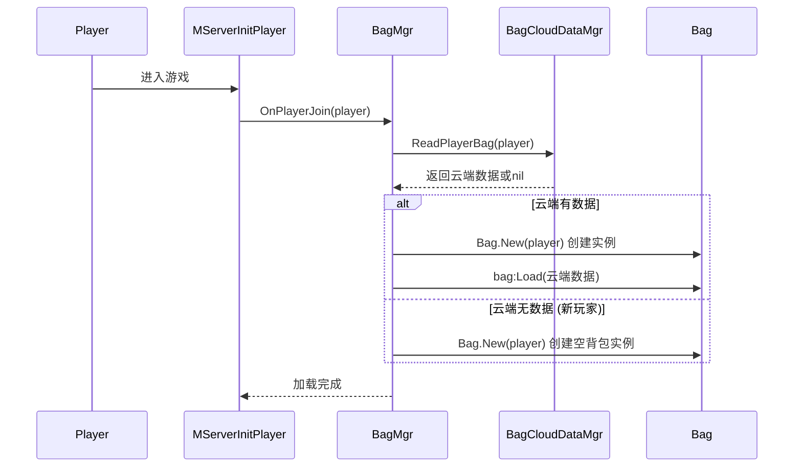
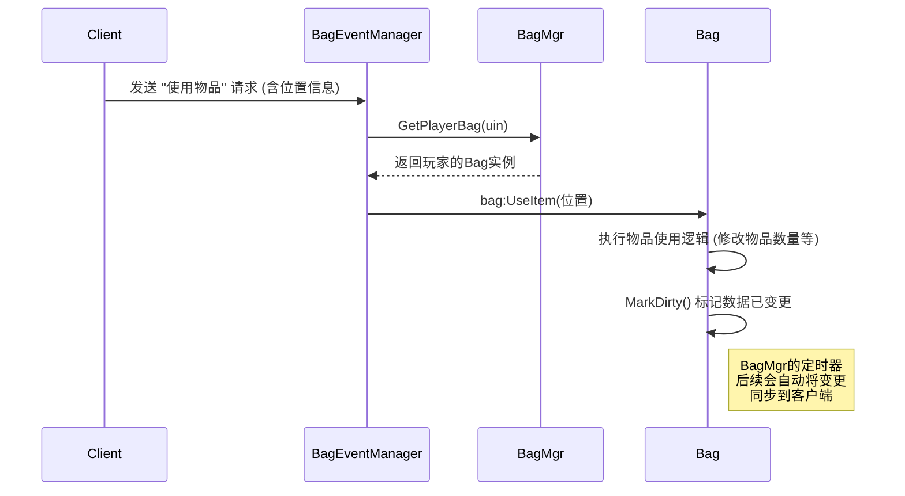
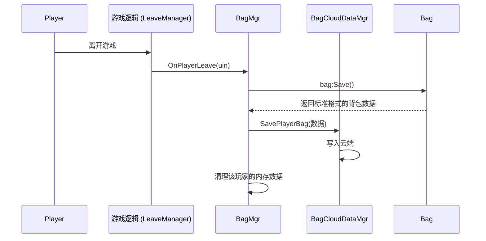

### 背包系统核心设计与数据流程

本文档旨在阐述背包系统的核心设计理念、数据结构和关键处理流程，以便在新项目中快速复用和扩展。

#### 一、核心设计理念

本背包系统遵循以下设计原则：

1.  **数据驱动**：背包内所有物品的展示和行为均由其数据驱动。
2.  **职责分离**：将系统拆分为职责明确的模块，如数据管理、事件处理和云端同步，使得代码更易于维护。
3.  **格式统一**：在内存、逻辑处理和云端存储之间，采用一套标准化的数据结构，避免了复杂的数据转换和潜在错误。
4.  **按需同步**：只在数据发生变更时标记并同步到客户端，减少不必要的网络开销。

#### 二、关键模块职责

背包系统主要由以下几个模块构成：

*   **`Bag.lua` (核心)**
    *   **职责**：定义了背包 (`Bag`) 和物品 (`ItemData`) 在**内存中**的数据结构。它负责背包的所有核心逻辑，如添加/移除物品、加载数据到内存、以及在需要保存时生成标准格式的数据包。
    *   **关键点**：它不直接与云端交互，只处理内存中的数据操作。

*   **`BagMgr.lua` (管理器)**
    *   **职责**：作为服务器端背包系统的**总管理器**。它在内存中持有一个全局的 `server_player_bag_data` 表，用于管理所有在线玩家的 `Bag` 实例。
    *   **关键点**：负责处理玩家上下线时的背包实例创建和销毁，并统一调度背包数据的客户端同步。

*   **`BagCloudDataMgr.lua` (云端数据接口)**
    *   **职责**：作为背包系统与**云端存储**之间的唯一接口。
    *   **关键点**：它全权负责将 `Bag` 模块准备好的标准数据包写入云端，以及从云端读取数据。在开发阶段，它假定所有读写的数据都符合标准格式。

*   **`BagEventManager.lua` (事件处理器)**
    *   **职责**：处理所有来自客户端的背包相关请求，如使用物品、分解装备等。
    *   **关键点**：它作为指令的接收者，将具体操作委托给对应玩家的 `Bag` 实例来执行。

*   **`MServerInitPlayer.lua` (玩家初始化入口)**
    *   **职责**：在玩家进入游戏时，调用 `BagMgr.OnPlayerJoin()`，触发背包的加载流程。

#### 三、核心数据结构

系统中最核心的数据结构是物品的存储格式，它在所有模块中保持统一。

*   **云端/内存 标准格式**:
    ```lua
    {
        items = {
            -- Key 是物品分类的数字索引, 对应 MConfig.ItemTypeEnum
            [1] = { -- 武器
                { name = "新手剑", amount = 1, enhanceLevel = 5, ... },
                { name = "屠龙刀", amount = 1, enhanceLevel = 0, ... }
            },
            [4] = { -- 材料
                { name = "铁矿", amount = 99, ... }
            }
        }
    }
    ```
    *   **`items`**: 包含所有物品分类的表。
    *   **`[数字索引]`**: `key` 是在 `MConfig.lua` 中定义的物品类型编号。
    *   **`[数组]`**: `value` 是一个数组，用于存放该分类下所有的 `ItemData` 对象，解决了同名但不同属性物品的存储问题。

#### 四、关键数据流程

**1. 玩家进入游戏 (加载背包)**



**2. 玩家请求使用物品**



**3. 玩家离开游戏 (保存背包)**

