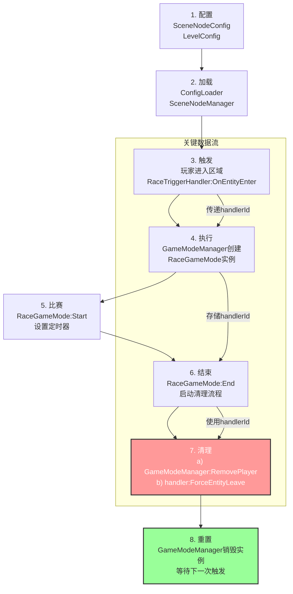

# 飞车挑战赛玩法 - 完整工作流程总结

我们构建的这套系统，从玩家踏入一个区域到一场比赛结束并重置，涉及了配置、加载、场景、模式、关卡五大核心模块。它们环环相扣，构成了一个完整的数据和逻辑闭环。

## 1. 配置层 (The "Blueprint")

这一切的起点是两个核心配置文件，它们是整个玩法的蓝图，定义了"什么东西"和"怎么玩"。

-   **`SceneNodeConfig.lua`**: 负责**连接物理世界与游戏逻辑**。
    -   **作用**: 它告诉服务器，场景里某个叫 `jump_plat` 的模型（由 `"场景节点路径"` 指定）不仅仅是个模型，它还是一个 `"飞行比赛"` 类型的触发器。
    -   **关键字段**:
        -   `"场景节点路径"`: `WorkSpace/Ground/Scene/jump_plat`
        -   `"场景类型"`: `"飞行比赛"` (这个值直接映射到要加载的处理器脚本)
        -   `"唯一ID"`: `"race_trigger_1"` (这个ID成为了触发器实例的唯一标识，即 `handlerId`)
        -   `"关联关卡"`: `飞车关卡初级` (将这个触发器和具体的关卡规则联系起来)

-   **`LevelConfig.lua`**: 负责**定义具体玩法规则**。
    -   **作用**: 它定义了ID为 `"l_race_1"` 的这场比赛到底怎么玩。
    -   **关键字段**:
        -   `"默认玩法"`: `"飞车挑战赛"` 这个是游戏的映射名称
        -   `"准备时间"`: `10` (秒)
        -   `"比赛时长"`: `60` (秒)

## 2. 加载与初始化 (Server Startup)

当服务器启动时，`MServerMain.lua` 会 orchestrate 一系列的加载操作，将静态的配置文件变成一个"活"的、等待响应的系统。

1.  **`ConfigLoader.Init()`**:
    -   `ConfigLoader` 被调用，它会 `require` 包括 `LevelConfig.lua` 在内的所有配置文件。
    -   同时，它也 `require` 了所有对应的 `*Type.lua` 文件（如我们创建的 `LevelType.lua`）。
    -   它遍历 `LevelConfig` 的数据，用 `LevelType.New()` 将每一条原始配置数据都实例化成一个结构清晰、接口规范的 `LevelType` 对象，并存储在 `ConfigLoader.Levels` 表中备用。

2.  **`SceneNodeManager.Init()`**:
    -   `SceneNodeManager` 开始工作，它读取 `SceneNodeConfig`。
    -   当读到我们的飞车配置时，它根据 `"场景节点路径"` 在游戏世界中找到 `jump_plat` 这个物理模型。
    -   它根据 `"场景类型"` (`"飞行比赛"`)，从 `HANDLER_TYPE_MAP` 映射表中找到了 `RaceTriggerHandler` 这个处理器类。
    -   它执行 `RaceTriggerHandler.New(node, config)`，创建了一个处理器实例。在这个过程中，`jump_plat` 模型的 `Touched` 事件被绑定，并且配置中的 `"唯一ID"` (`"race_trigger_1"`) 被存为了处理器的 `handlerId`。
    -   最后，这个新创建的处理器实例以它的 `handlerId` 为键，被注册到了 `MServerDataManager` 的全局管理器中。

至此，服务器完全准备就绪。`jump_plat` 模型不再是一个死物，它拥有了一个随时待命的 `RaceTriggerHandler` 处理器。

## 3. 玩家触发 (The "Spark")

1.  玩家角色走进 `jump_plat` 区域，物理引擎触发了 `Touched` 事件。
2.  `RaceTriggerHandler` 的事件监听器被激活，`OnEntityEnter` 方法被调用。
3.  在 `OnEntityEnter` 中：
    -   它从自身的配置中读取到 `"关联关卡"` 是 `"l_race_1"`。
    -   它向 `ConfigLoader` 请求 `"l_race_1"` 的数据，获得了我们之前加载好的那个 `LevelType` 实例。
    -   从 `LevelType` 实例中，它轻松地获取了玩法名称 (`.defaultGameMode` -> `"RaceGameMode"`) 和所有规则 (`:GetRules()`)。
    -   它调用 `GameModeManager:AddPlayerToMode()`，并将**玩家实例、玩法名称、实例ID、规则表、以及它自身的 `handlerId`** 全部作为参数传递过去。

## 4. 游戏模式执行 (The Gameplay Loop)

1.  `GameModeManager` 接收到请求，发现当前没有对应 `instanceId` 的比赛，于是：
    -   它从预加载的 `AVAILABLE_MODES` 表中，用 `"RaceGameMode"` 作为键，找到了 `RaceGameMode` 这个类。
    -   它执行 `RaceGameMode.New()` 创建了一个新的比赛实例，并将 `handlerId` 存入了该实例中。
2.  在 `RaceGameMode` 实例内部：
    -   `OnPlayerEnter` 被调用，玩家被加入到 `participants` 数组中。
    -   因为是第一个玩家，`Start()` 方法被触发。
    -   `Start()` 使用基类的 `AddDelay` 方法，创建了两个引擎定时器：一个用于10秒后开始比赛，另一个用于60秒后结束比赛。

## 5. 结算与状态重置 (The Cleanup)

这是最关键的闭环部分，确保了游戏可以被反复触发。

1.  60秒比赛定时器触发，调用 `RaceGameMode:End()`。
2.  `End()` 方法：
    -   向所有参赛玩家发送结算信息 (`SendHoverText`)。
    -   启动**第三个定时器**，延迟时间为配置中的 `准备时间`（10秒）。
3.  10秒结算展示定时器触发，执行核心清理逻辑：
    -   它懒加载 `GameModeManager` 和 `ServerDataManager`。
    -   它使用存在自己实例里的 `self.handlerId`，通过 `ServerDataManager.getSceneNodeHandler()`，精准地找到了当初触发它的那个 `RaceTriggerHandler` 实例。
    -   它遍历一个**参与者副本**（避免在遍历时修改原表），对每个玩家执行两个关键操作：
        a.  `GameModeManager:RemovePlayerFromCurrentMode(player)`: 将玩家从**比赛模式**中移除。
        b.  `handler:ForceEntityLeave(player)`: 调用我们为 `RaceTriggerHandler` 添加的强制离开方法，将玩家从**场景交互**的状态中也清除。**这是保证两个系统状态同步的关键**。
4.  当最后一个玩家被 `RemovePlayerFromCurrentMode` 移除后，`GameModeManager` 检测到比赛实例已空，便调用该实例的 `Destroy()` 方法，彻底清理掉为这场比赛创建的所有定时器节点，完成最后的资源回收。

至此，整个系统被完美重置，等待下一位玩家踏入 `jump_plat`，开启新一轮的挑战。

## 流程图

</rewritten_file> 