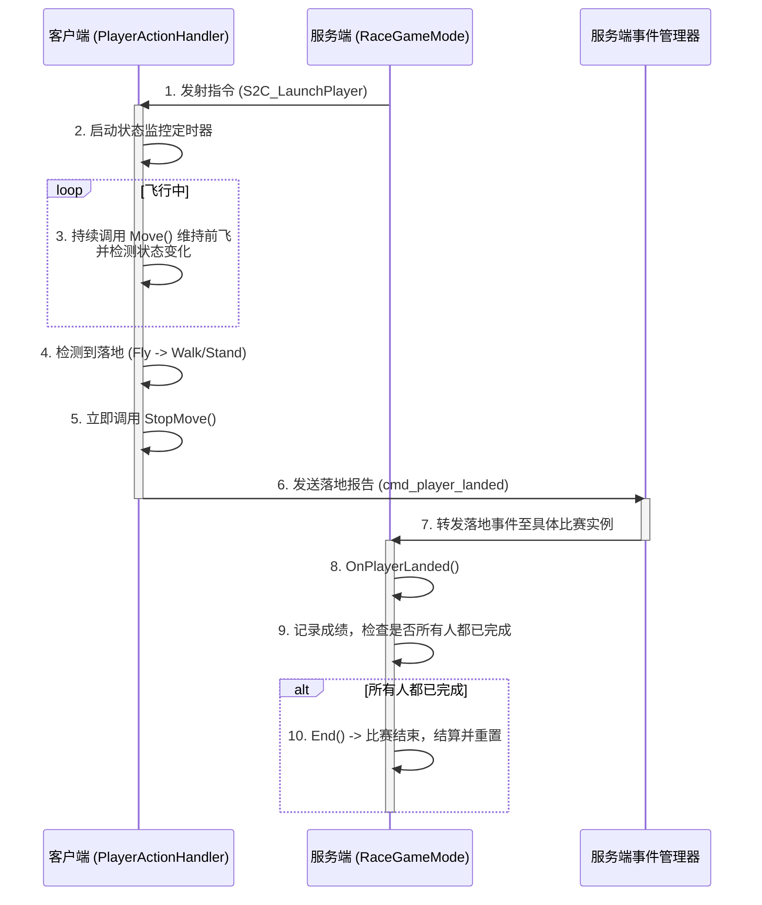

# 飞车挑战赛玩法 - 完整工作流程总结 (v2.0)

我们构建的这套系统，从玩家踏入一个区域到一场比赛结束并重置，涉及了配置、服务端逻辑、客户端交互三大块，以及场景、模式、关卡等核心模块。它们环环相扣，构成了一个完整的数据和逻辑闭环。

## 1. 配置层 (The "Blueprint")

这一切的起点是三个核心配置文件，它们是整个玩法的蓝图，定义了"什么东西"和"怎么玩"。

-   **`SceneNodeConfig.lua`**: 负责**连接物理世界与游戏逻辑**。
    -   **作用**: 它告诉服务器，场景里某个叫 `jump_plat` 的模型不仅仅是个模型，它还是一个 `"飞行比赛"` 类型的触发器，并且关联了具体的关卡规则。
    -   **关键字段**: `"场景节点路径"`, `"场景类型"`, `"唯一ID"` (`handlerId`), `"关联关卡"`。

-   **`LevelConfig.lua`**: 负责**定义具体玩法规则**。
    -   **作用**: 它定义了这场比赛到底怎么玩。
    -   **关键字段**: `"默认玩法"` (`"飞车挑战赛"`), `"准备时间"`, `"比赛时长"`。

-   **`EventPlayerConfig.lua`**: 负责**定义客户端-服务端通信的事件契约**。
    -   **作用**: 它统一管理了所有事件的名称，避免了在代码中出现“魔法字符串”，确保客户端和服务端对事件的理解是一致的。
    -   **关键事件**: `NOTIFY.LAUNCH_PLAYER` (服务端->客户端), `REQUEST.PLAYER_LANDED` (客户端->服务端)。

## 2. 服务端：加载与初始化 (Server Startup)

当服务器启动时，`MServerMain.lua` 会 orchestrate 一系列的加载操作，将静态的配置文件变成一个"活"的、等待响应的系统。

1.  **`ConfigLoader.Init()`**: 加载所有 `*Config.lua` 和 `*Type.lua` 文件，将配置数据实例化为结构清晰的对象。
2.  **`SceneNodeManager.Init()`**:
    -   读取 `SceneNodeConfig`，根据 `"场景类型"` 找到并实例化对应的处理器 `RaceTriggerHandler`。
    -   将处理器的 `handlerId` 和实例注册到 `MServerDataManager` 的全局管理器中，并将处理器的 `Touched` 事件与物理世界绑定。
3.  **`RaceGameEventManager.Init()`**:
    -   这是一个**静态事件管理器**，它在启动时就订阅了 `EventPlayerConfig.REQUEST.PLAYER_LANDED` 事件。它的唯一职责就是监听客户端的落地报告。

至此，服务器完全准备就绪。`jump_plat` 模型不再是一个死物，它拥有了一个随时待命的 `RaceTriggerHandler` 处理器，并且整个服务器都在监听着玩家的落地事件。

## 3. 服务端：玩家触发与比赛开始 (The "Spark")

1.  玩家角色走进 `jump_plat` 区域，`RaceTriggerHandler` 的 `OnEntityEnter` 方法被调用。
2.  处理器根据配置找到关联的关卡和玩法，调用 `GameModeManager:AddPlayerToMode()`。
3.  `GameModeManager` 创建一个新的 `RaceGameMode` 实例。
4.  `RaceGameMode:Start()` 被调用，在指定的“准备时间”后，比赛正式开始。
5.  **发射玩家**:
    -   `RaceGameMode` 遍历所有参赛者，调用 `LaunchPlayer(player)`。
    -   `LaunchPlayer` 方法**不会直接控制玩家**，而是从 `EventPlayerConfig` 中读取飞行参数，然后通过网络通道向**指定客户端**发送 `S2C_LaunchPlayer` 事件。

## 4. 客户端：飞行与落地检测 (The Client's Role)

这是整个交互的核心，完全由客户端的 `PlayerActionHandler.lua` 负责。

1.  **接收指令**: `PlayerActionHandler` 监听到 `S2C_LaunchPlayer` 事件，触发 `OnLaunchPlayer` 方法。
2.  **启动监控**: 方法的核心是启动一个高频定时器 `stateMonitorTimer` (例如每0.2秒一次)。
3.  **定时器任务**:
    -   **维持飞行**: 只要检测到玩家状态 `actor:GetCurMoveState()` 是 `Enum.BehaviorState.Fly`，就持续调用 `actor:Move()`，模拟“按住W键”的效果，实现平滑的空中前飞。
    -   **检测落地**: 它持续比较上一帧和当前帧的状态。当状态从 `Fly` 首次变为 `Walk` 或 `Stand` 时，就认为玩家已确切落地。
4.  **报告落地**:
    -   在检测到落地的**同一帧**，它立即调用 `actor:StopMove()` 避免角色继续前冲。
    -   然后，它从 `EventPlayerConfig.REQUEST.PLAYER_LANDED` 读取事件名，向服务端发送 `cmd_player_landed` 事件。
    -   最后，它销毁自己的 `stateMonitorTimer`，完成任务。

## 5. 服务端：落地响应与比赛结束 (Finishing the Race)

1.  **事件路由**: `RaceGameEventManager` 捕获到 `cmd_player_landed` 事件。它作为一个全局的静态路由，不处理具体逻辑，而是负责找到该玩家所在的 `RaceGameMode` 实例。
2.  **逻辑处理**: 它调用该 `RaceGameMode` 实例的 `OnPlayerLanded(player)` 方法。
3.  **记录与判断**:
    -   `OnPlayerLanded` 将玩家标记为已完成，并使用 `for _ in pairs(...)` 循环**正确地**统计已完成人数（避免了对稀疏表使用 `#` 的陷阱）。
    -   如果已完成人数等于总参赛人数，则立即调用 `self:End()` 结束比赛。
    -   同时，`Start()` 方法中设置的**超时定时器**依然存在，作为保险，确保比赛在任何情况下都能在“比赛时长”到达后被强制结束。
4.  **结算与重置**: `End()` 方法负责结算和清理。最关键的一步是，它会使用创建时保存的 `handlerId` 找到最初的 `RaceTriggerHandler` 实例，并调用其 `ForceEntityLeave` 方法，将玩家从触发器的状态中也移除，确保了**玩法系统和场景交互系统两个模块的状态同步**，让整个流程可以被完美重置。

## 6. 核心交互流程图

