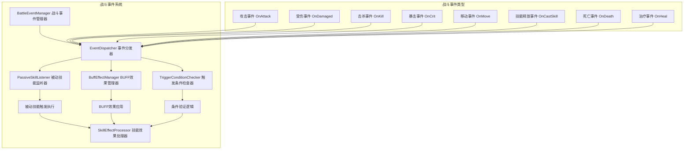
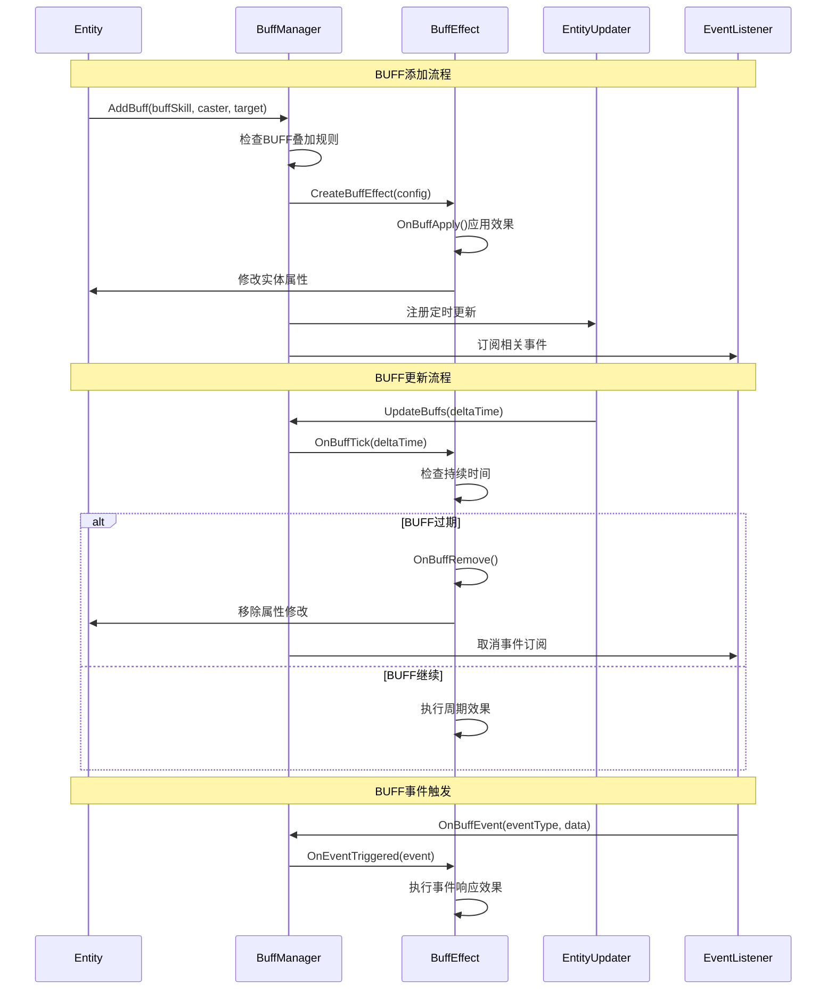
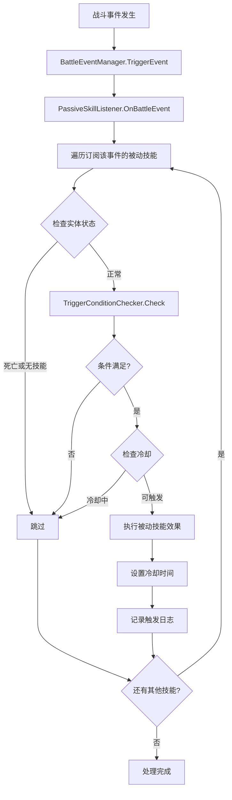
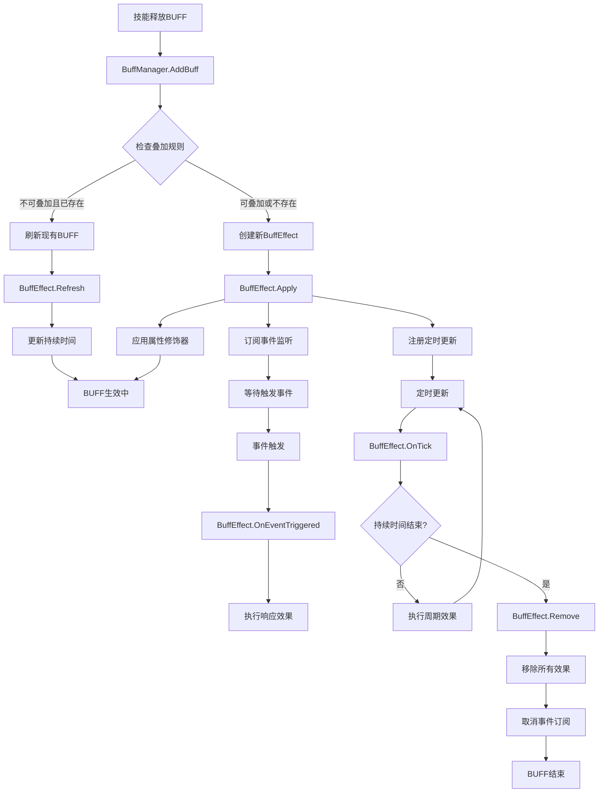

# 被动技能和BUFF技能战斗触发系统设计

## 1. 事件驱动的触发系统架构



## 2. 被动技能触发流程设计

### 2.1 被动技能监听系统

```lua
-- 被动技能监听器
---@class PassiveSkillListener
---@field eventSubscriptions table<string, PassiveSkill[]> 事件订阅表
---@field conditionChecker TriggerConditionChecker 条件检查器
local PassiveSkillListener = {}

function PassiveSkillListener:New()
    local instance = {}
    setmetatable(instance, {__index = self})
    instance.eventSubscriptions = {}
    instance.conditionChecker = TriggerConditionChecker:New()
    return instance
end

-- 注册被动技能监听
function PassiveSkillListener:RegisterPassiveSkill(entity, passiveSkill)
    local triggerEvents = passiveSkill.config.triggerEvents or {}
    
    for _, eventType in ipairs(triggerEvents) do
        if not self.eventSubscriptions[eventType] then
            self.eventSubscriptions[eventType] = {}
        end
        
        table.insert(self.eventSubscriptions[eventType], {
            entity = entity,
            skill = passiveSkill,
            priority = passiveSkill.config.priority or 0
        })
        
        -- 按优先级排序
        table.sort(self.eventSubscriptions[eventType], function(a, b)
            return a.priority > b.priority
        end)
    end
end

-- 处理战斗事件
function PassiveSkillListener:OnBattleEvent(eventType, eventData)
    local listeners = self.eventSubscriptions[eventType]
    if not listeners then return end
    
    -- for _, listener in ipairs(listeners) do
    --     local entity = listener.entity
    --     local skill = listener.skill
        
    --     -- 检查实体状态
    --     if entity.isDead or not entity:HasSkill(skill.skillId) then
    --         goto continue
    --     end
        
    --     -- 检查触发条件
    --     if self.conditionChecker:CheckTriggerConditions(skill, entity, eventData) then
    --         -- 检查冷却时间
    --         if not entity:IsCoolingdown("passive_" .. skill.skillId) then
    --             -- 触发被动技能
    --             self:TriggerPassiveSkill(entity, skill, eventData)
                
    --             -- 设置冷却
    --             if skill.config.cooldown > 0 then
    --                 entity:SetCooldown("passive_" .. skill.skillId, skill.config.cooldown)
    --             end
    --         end
    --     end
        
    --     ::continue::
    -- end
end

-- 触发被动技能
function PassiveSkillListener:TriggerPassiveSkill(entity, skill, eventData)
    local executionContext = {
        caster = entity,
        trigger = eventData.source,
        target = eventData.target,
        eventType = eventData.eventType,
        eventData = eventData
    }
    
    -- 执行技能效果
    for _, effect in ipairs(skill.effects) do
        SkillEffectProcessor:ProcessEffect(effect, executionContext)
    end
    
    -- 记录触发日志
    if skill.config.enableLog then
        ----gg.log(string.format("被动技能触发: %s [%s] -> %s", 
            entity.name, skill.skillName, eventData.eventType))
    end
end
```

### 2.2 被动技能配置示例

```lua
-- 被动技能配置
PassiveSkillConfigs = {
    ["反击"] = {
        skillType = "PassiveSkill",
        skillId = "counter_attack",
        skillName = "反击",
        triggerEvents = {"OnDamaged"},
        priority = 100,
        cooldown = 2.0,
        triggerConditions = {
            {
                conditionType = "ChanceCondition",
                chance = 30 -- 30%几率触发
            },
            {
                conditionType = "HealthCondition",
                minPercent = 0,
                maxPercent = 50 -- 血量低于50%时才触发
            }
        },
        effects = {
            {
                effectType = "DamageEffect",
                damageType = "PHYSICAL",
                value = 150, -- 150%攻击力
                isPercentage = true,
                target = "TRIGGER_SOURCE" -- 攻击来源
            }
        }
    },
    
    ["生命偷取"] = {
        skillType = "PassiveSkill",
        skillId = "life_steal",
        skillName = "生命偷取",
        triggerEvents = {"OnDealDamage"},
        triggerConditions = {
            {
                conditionType = "DamageTypeCondition",
                damageTypes = {"PHYSICAL", "FIRE"}
            }
        },
        effects = {
            {
                effectType = "HealEffect",
                value = 20, -- 伤害的20%
                isPercentage = true,
                target = "SELF",
                baseValue = "DAMAGE_DEALT"
            }
        }
    },
    
    ["战斗专家"] = {
        skillType = "PassiveSkill",
        skillId = "combat_expert",
        skillName = "战斗专家",
        triggerEvents = {"OnCombatStart"},
        isAura = true, -- 光环技能
        effects = {
            {
                effectType = "AttributeBoostEffect",
                attributes = {
                    attack = {value = 25, isPercentage = true},
                    critRate = {value = 10, isPercentage = false}
                },
                duration = -1, -- 永久生效
                target = "SELF"
            }
        }
    }
}
```

## 3. BUFF系统触发和管理流程

### 3.1 BUFF管理器设计



### 3.2 BUFF效果实现

```lua
-- BUFF管理器
---@class BuffManager
---@field activeBuffs table<string, BuffEffect[]> 活跃BUFF列表
---@field buffUpdateTimer table 更新定时器
local BuffManager = {}

function BuffManager:New(entity)
    local instance = {}
    setmetatable(instance, {__index = self})
    instance.entity = entity
    instance.activeBuffs = {}
    instance.buffUpdateTimer = {}
    return instance
end

-- 添加BUFF
function BuffManager:AddBuff(buffConfig, caster, target, power)
    local buffId = buffConfig.skillId
    local existingBuffs = self.activeBuffs[buffId] or {}
    
    -- 检查叠加规则
    local canStack, shouldRefresh = self:CheckStackRules(buffConfig, existingBuffs)
    
    if not canStack and #existingBuffs > 0 then
        if shouldRefresh then
            -- 刷新现有BUFF
            existingBuffs[1]:Refresh(power)
        end
        return false
    end
    
    -- 创建新BUFF效果
    local buffEffect = BuffEffect:New(buffConfig, caster, target, power)
    
    -- 添加到列表
    if not self.activeBuffs[buffId] then
        self.activeBuffs[buffId] = {}
    end
    table.insert(self.activeBuffs[buffId], buffEffect)
    
    -- 检查最大叠加数
    if #self.activeBuffs[buffId] > buffConfig.maxStack then
        local oldestBuff = table.remove(self.activeBuffs[buffId], 1)
        oldestBuff:Remove()
    end
    
    -- 应用BUFF效果
    buffEffect:Apply()
    
    -- 注册更新
    self:RegisterBuffUpdate(buffEffect)
    
    return true
end

-- BUFF效果类
---@class BuffEffect
---@field config BuffSkillConfig BUFF配置
---@field caster Entity 施法者
---@field target Entity 目标
---@field power number 威力
---@field duration number 剩余持续时间
---@field stackCount number 叠加层数
---@field isActive boolean 是否活跃
local BuffEffect = {}

function BuffEffect:New(config, caster, target, power)
    local instance = {}
    setmetatable(instance, {__index = self})
    instance.config = config
    instance.caster = caster
    instance.target = target
    instance.power = power or 1.0
    instance.duration = config.duration or 0
    instance.stackCount = 1
    instance.isActive = true
    instance.appliedEffects = {}
    return instance
end

-- 应用BUFF效果
function BuffEffect:Apply()
    for _, effect in ipairs(self.config.effects) do
        local appliedEffect = self:ApplyEffect(effect)
        table.insert(self.appliedEffects, appliedEffect)
    end
    
    -- 订阅事件监听
    if self.config.eventTriggers then
        for _, eventType in ipairs(self.config.eventTriggers) do
            BattleEventManager:Subscribe(eventType, self, self.OnEventTriggered)
        end
    end
end

-- 应用单个效果
function BuffEffect:ApplyEffect(effectConfig)
    local effectType = effectConfig.effectType
    
    if effectType == "AttributeModifier" then
        return self:ApplyAttributeModifier(effectConfig)
    elseif effectType == "PeriodicDamage" then
        return self:ApplyPeriodicDamage(effectConfig)
    elseif effectType == "PeriodicHeal" then
        return self:ApplyPeriodicHeal(effectConfig)
    elseif effectType == "StatusImmunity" then
        return self:ApplyStatusImmunity(effectConfig)
    end
end

-- 属性修饰器效果
function BuffEffect:ApplyAttributeModifier(effectConfig)
    local modifier = {
        attributeType = effectConfig.attributeType,
        value = effectConfig.value * self.power * self.stackCount,
        isPercentage = effectConfig.isPercentage,
        source = self.config.skillId
    }
    
    self.target:AddAttributeModifier(modifier)
    return modifier
end

-- BUFF刷新
function BuffEffect:Refresh(newPower)
    self.duration = self.config.duration
    if self.config.refreshStacksPower then
        self.power = newPower or self.power
        self:UpdateEffects()
    end
end

-- 更新效果
function BuffEffect:UpdateEffects()
    -- 移除旧效果
    for _, appliedEffect in ipairs(self.appliedEffects) do
        self:RemoveEffect(appliedEffect)
    end
    
    -- 重新应用效果
    self.appliedEffects = {}
    self:Apply()
end

-- BUFF移除
function BuffEffect:Remove()
    self.isActive = false
    
    -- 移除所有效果
    for _, appliedEffect in ipairs(self.appliedEffects) do
        self:RemoveEffect(appliedEffect)
    end
    
    -- 取消事件订阅
    if self.config.eventTriggers then
        for _, eventType in ipairs(self.config.eventTriggers) do
            BattleEventManager:Unsubscribe(eventType, self)
        end
    end
end

-- 事件触发响应
function BuffEffect:OnEventTriggered(eventType, eventData)
    local responses = self.config.eventResponses[eventType]
    if not responses then return end
    
    for _, response in ipairs(responses) do
        self:ExecuteResponse(response, eventData)
    end
end
```

## 4. 战斗事件系统

### 4.1 事件管理器

```lua
-- 战斗事件管理器
---@class BattleEventManager
---@field eventListeners table<string, table[]> 事件监听器
local BattleEventManager = {}

function BattleEventManager:Subscribe(eventType, listener, callback)
    if not self.eventListeners[eventType] then
        self.eventListeners[eventType] = {}
    end
    
    table.insert(self.eventListeners[eventType], {
        listener = listener,
        callback = callback
    })
end

function BattleEventManager:TriggerEvent(eventType, eventData)
    local listeners = self.eventListeners[eventType]
    if not listeners then return end
    
    for _, listenerData in ipairs(listeners) do
        local success, result = pcall(listenerData.callback, listenerData.listener, eventType, eventData)
        if not success then
            ----gg.log("事件处理错误:", eventType, result)
        end
    end
end

-- 战斗事件类型定义
BattleEventType = {
    ON_ATTACK = "OnAttack",               -- 攻击时
    ON_DAMAGED = "OnDamaged",             -- 受伤时
    ON_DEAL_DAMAGE = "OnDealDamage",      -- 造成伤害时
    ON_KILL = "OnKill",                   -- 击杀时
    ON_DEATH = "OnDeath",                 -- 死亡时
    ON_CRIT = "OnCrit",                   -- 暴击时
    ON_HEAL = "OnHeal",                   -- 治疗时
    ON_CAST_SKILL = "OnCastSkill",        -- 释放技能时
    ON_MOVE = "OnMove",                   -- 移动时
    ON_COMBAT_START = "OnCombatStart",    -- 战斗开始
    ON_COMBAT_END = "OnCombatEnd",        -- 战斗结束
    ON_LEVEL_UP = "OnLevelUp",            -- 升级时
    ON_PICKUP_ITEM = "OnPickupItem",      -- 拾取物品时
}
```

## 5. 实际应用流程图

### 5.1 被动技能完整触发流程



### 5.2 BUFF系统完整流程



## 6. 优化和性能考虑

### 6.1 性能优化策略

1. **事件监听器优先级排序**: 按优先级执行，高优先级技能先触发
2. **条件检查缓存**: 缓存复杂条件的检查结果
3. **BUFF更新批处理**: 将多个BUFF的更新合并到一次操作中
4. **内存池管理**: 重用BUFF和事件对象，减少GC压力

### 6.2 扩展性设计

1. **插件化事件处理**: 新的事件类型可以动态注册
2. **自定义条件检查器**: 支持添加新的触发条件类型
3. **效果组合器**: 支持复杂的效果组合和链式触发
4. **调试和监控**: 内置性能监控和调试工具

这套系统设计结合了您原有代码的优点，同时借鉴了《魔兽世界》、《英雄联盟》等游戏的成熟机制，确保了被动技能和BUFF系统的稳定性和扩展性。
